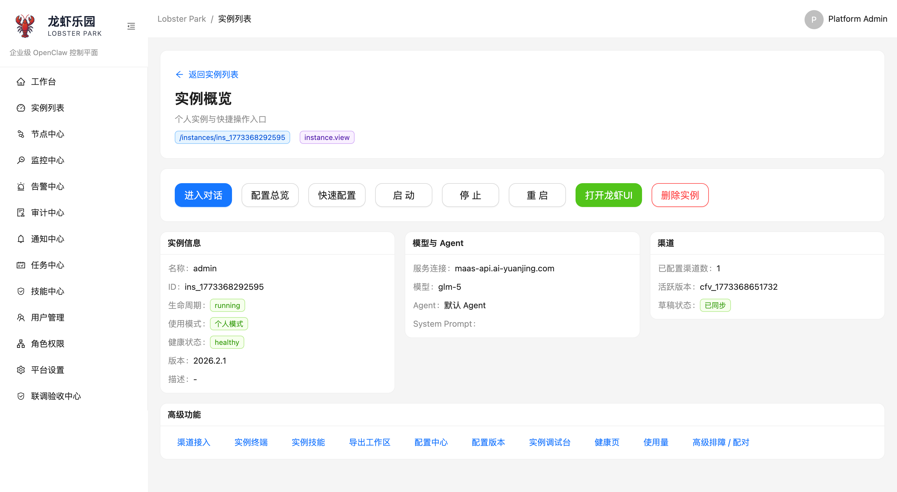
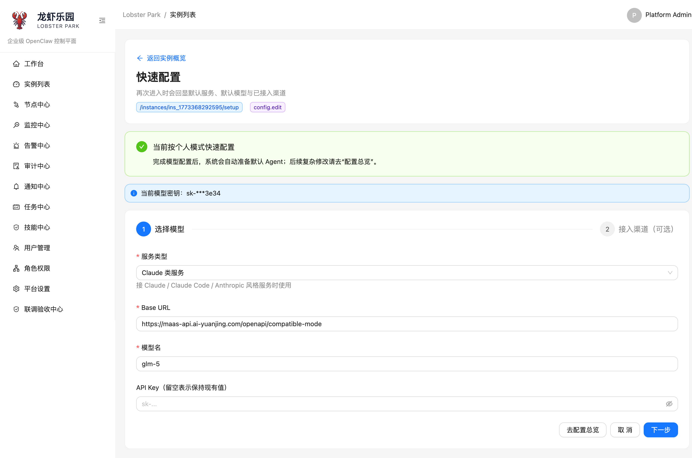
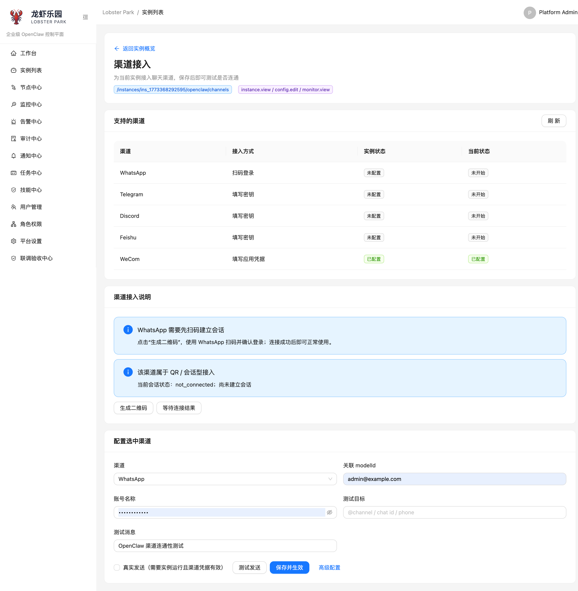
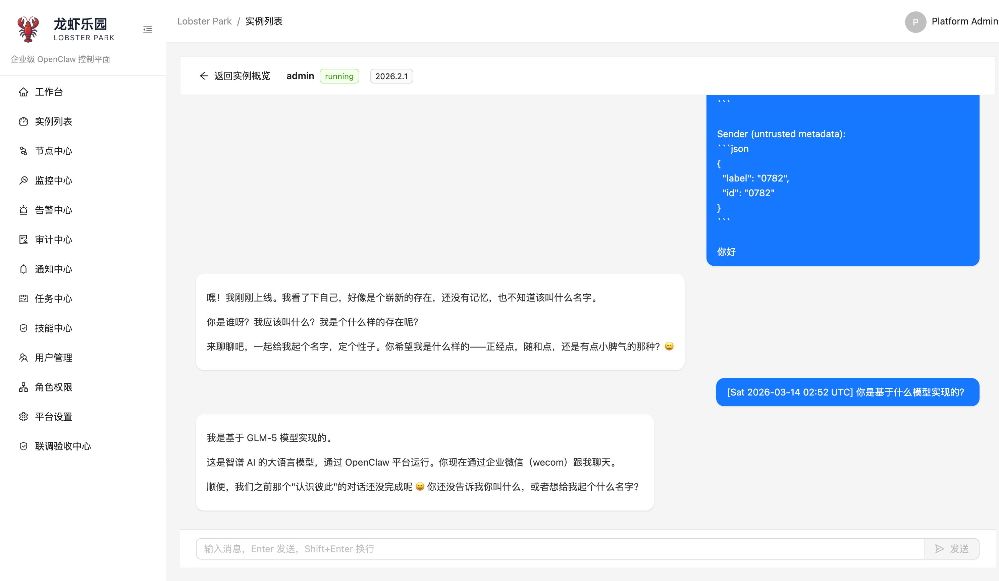
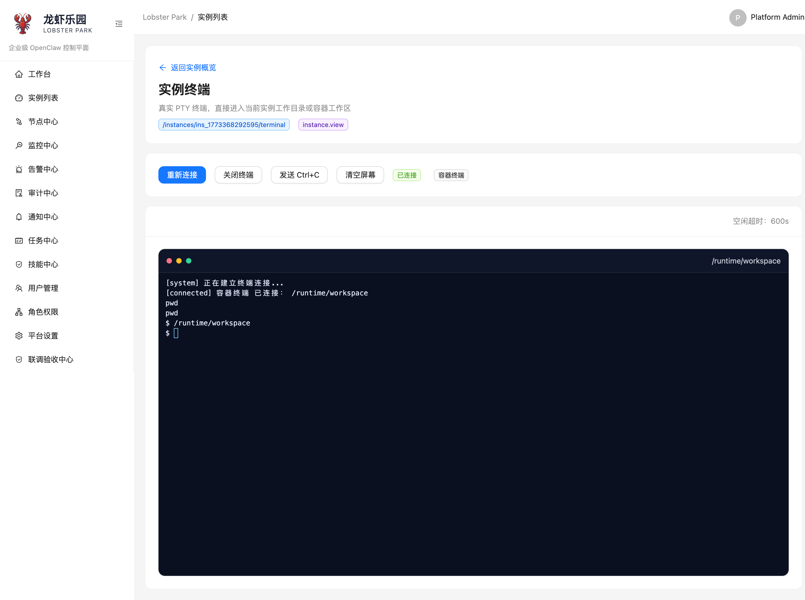

<div align="center">
  <h1>Lobster Park</h1>
  <p><strong>面向 OpenClaw 的企业级控制平面</strong></p>
  <p>把实例创建、模型接入、Agent 管理、渠道连通和运行时运维收敛到一个控制台里。</p>
  <p>
    
    
    
    
  </p>
</div>

## 项目简介

Lobster Park 不是 OpenClaw 的替代品，而是 OpenClaw 之上的控制平面。

它解决的是同一类问题：

- 用户不想自己手工维护 OpenClaw 配置文件
- 实例需要隔离运行，而不是所有人共享一个运行时
- 模型、Agent、渠道接入需要可视化管理
- 平台对话、原生 UI、实例终端、健康检查需要统一入口
- 管理员需要用户体系、权限隔离、审计和部署手册

当前仓库已经覆盖一个可工作的最小闭环：

1. 用户登录平台
2. 创建独立 OpenClaw 实例
3. 通过快速配置或配置总览接入模型
4. 在平台内完成对话连通性验证
5. 接入渠道并在 OpenClaw 侧生效

## 功能一览

- **实例生命周期管理**：创建、启动、停止、重启、删除独立 OpenClaw 实例
- **快速配置引导**：新实例通过最小表单完成模型接入，并在跳转前执行平台对话探活
- **配置总览**：集中维护服务连接、模型、Agent、渠道账号与路由关系
- **渠道接入**：统一接入 `WhatsApp`、`Telegram`、`Discord`、`Feishu`、`WeCom`
- **多入口调试**：支持平台对话、OpenClaw 原生 UI、实例调试台、实例终端
- **本地用户体系**：支持平台超管与真实用户，普通用户默认只看到自己的实例与数据
- **单机部署方案**：提供 Linux 单机安装脚本、systemd 服务与运维文档

## 项目截图

### 实例概览



### 快速配置



### 渠道接入



### 平台对话



### 实例终端



## 核心能力

| 模块 | 当前能力 |
| --- | --- |
| 用户体系 | 支持本地超管与真实用户，普通用户默认只看到自己的实例与数据 |
| 实例管理 | 创建、启动、重启、删除实例；实例默认按独立运行时隔离 |
| 快速配置 | 新实例可通过引导流程完成模型配置，并在跳转前执行平台对话连通性测试 |
| 配置总览 | 结构化管理服务连接、模型、Agent、渠道账号与路由关系 |
| 模型协议 | 支持 `openai-responses`、`openai-completions`、`anthropic-messages`、`google-generative-ai`、`ollama` |
| 渠道接入 | 当前主展示渠道为 `WhatsApp`、`Telegram`、`Discord`、`Feishu`、`WeCom` |
| 对话入口 | 支持平台对话、OpenClaw 原生 UI、实例调试台 |
| 终端能力 | 支持实例真实终端，会话基于 WebSocket 连接到运行时 |
| 运维能力 | 支持实例健康状态、运行态检查、日志与 Linux 单机部署脚本 |

## 适用场景

- 想把 OpenClaw 封装成普通用户也能上手的平台
- 想把模型接入、Agent 管理、渠道配置从 JSON 改成表单
- 想让每个实例独立运行，降低串配置和串数据风险
- 想在单台 Linux 服务器上部署一套可持续运维的 OpenClaw 控制面

## 当前支持矩阵

### 运行环境

- 生产部署：`Linux` 单机
- 源码开发：`macOS` / `Linux`
- OpenClaw 运行模式：`container` / `process`

### 环境要求

- `Node.js` 20+
- `pnpm` 9+
- `Docker` / `Docker Compose`

### 模型服务类型

- `通用云端模型（默认）` → `openai-responses`
- `兼容对话接口` → `openai-completions`
- `Claude 类服务` → `anthropic-messages`
- `Gemini 服务` → `google-generative-ai`
- `本地 Ollama` → `ollama`

### 渠道

- `WhatsApp`
- `Telegram`
- `Discord`
- `Feishu`
- `WeCom`

## 快速开始

### 1. 本地开发

```bash
cp .env.example .env
pnpm bootstrap
pnpm infra:up
pnpm db:reset
pnpm db:seed
pnpm generate:api
pnpm server:dev
pnpm web:dev
```

默认地址：

- Server: `http://127.0.0.1:3301`
- Web: `http://127.0.0.1:5173`

### 2. 本地预览

```bash
pnpm build
pnpm server:start:local
pnpm web:start:local
```

默认地址：

- Server: `http://127.0.0.1:3301`
- Web Preview: `http://127.0.0.1:4173`

停止：

```bash
pnpm server:stop:local
pnpm web:stop:local
pnpm infra:down
```

### 3. 一体容器启动

```bash
pnpm docker:config
pnpm app:up
```

默认地址：

- Web: `http://127.0.0.1:8080`
- Server: `http://127.0.0.1:3301`

停止：

```bash
pnpm app:down
```

## 关键配置

开发期最常见的是根目录 `.env`，部署期最常见的是 `deploy/linux/.env.example` 对应的环境变量。

常见关键项：

| 变量 | 用途 |
| --- | --- |
| `PORT` | 后端 API 监听端口 |
| `DATABASE_URL` | PostgreSQL 连接串 |
| `REDIS_URL` | Redis 连接串 |
| `SECRET_MASTER_KEY` | 平台密钥主密钥 |
| `WEB_APP_ORIGIN` | 浏览器访问地址 |
| `CORS_ORIGINS` | 允许的前端来源 |
| `OPENCLAW_RUNTIME_MODE` | OpenClaw 运行模式，支持 `container` / `process` |
| `OPENCLAW_CONTAINER_IMAGE` | OpenClaw 容器镜像 |
| `RUNTIME_BASE_PATH` | 实例运行时目录 |

生产环境建议优先看：`docs/deployment/linux-single-server-delivery.md`

## 验证

基础全量验证：

```bash
pnpm verify:full
```

包含 Playwright 的验证：

```bash
pnpm verify:full:e2e
```

如果需要做渠道联调或手工 smoke，见 `docs/examples/README.md`。

## 部署

- Linux 单机安装：`docs/deployment/linux-single-server.md`
- 生产部署运行手册：`docs/deployment/linux-single-server-delivery.md`

## 仓库结构

```text
apps/
  server/      NestJS 后端 API 与运行时编排
  web/         React + Vite 控制台
packages/
  shared/      共享类型与常量
deploy/
  linux/       单机 Linux 安装器、systemd、运维脚本
docker/
  openclaw-runtime/  平台约束版 OpenClaw runtime 镜像
docs/
  deployment/  部署文档
  examples/    联调与 smoke 示例
  archive/     历史需求与 OpenAPI 归档
```

## 文档

- 文档索引：`docs/README.md`
- 渠道与 smoke 示例：`docs/examples/README.md`
- 产品历史归档：`docs/archive/product-history/README.md`

## 技术栈

| 层 | 技术 |
| --- | --- |
| 前端 | `React` + `Vite` + `Ant Design` |
| 后端 | `NestJS` + `Prisma` |
| 数据存储 | `PostgreSQL` + `Redis` |
| 运行时编排 | Docker / 本地进程双适配 |
| 实例交互 | HTTP API + WebSocket + PTY |
| 运行时基础 | `OpenClaw` |

## 当前状态

当前仓库更适合下面两类使用方式：

- 作为 OpenClaw 控制平面的源码仓库继续演进
- 作为单台 Linux 服务器上的可部署产品使用

当前已完成的重点能力：

- 实例隔离运行
- 快速配置闭环
- 平台对话可用
- 渠道接入可用
- 实例终端可用
- 本地用户体系可用

当前仍建议持续增强的方向：

- 更完善的多机 / 高可用部署方案
- 更完整的可观测性与报表
- 更细粒度的配置治理与模板能力
- 更系统化的公开 Roadmap 与 Release 流程

## 开源说明

- 当前许可证：`MIT`
- 许可证文件：`LICENSE`
- 安全问题反馈：`SECURITY.md`
- 贡献说明：`CONTRIBUTING.md`
- 行为准则：`CODE_OF_CONDUCT.md`

## License

本项目使用 `MIT` 许可证。

这意味着你可以在遵守许可证条款的前提下：

- 商业使用
- 修改源码
- 分发衍生版本
- 在企业内部继续封装部署

完整条款见 `LICENSE`。

