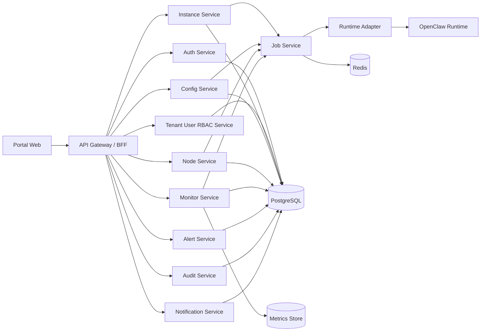

# Lobster Park / 龙虾乐园 开发实现包 V1.2

- 文档类型：研发开工包 / 架构、接口、表结构、契约说明
- 对应 PRD：`LobsterPark_PRD_V1_2.md`
- 配套补充文档：`LobsterPark_Supplement_V1_2.md`
- 配套 OpenAPI：`LobsterPark_OpenAPI_V1_2.yaml`
- 版本：V1.2
- 产出日期：2026-03-06

## 0. 文档治理

### 0.1 变更历史

| 版本 | 日期 | 变更摘要 |
|---|---|---|
| V1.0 | 2026-03-06 | 初版开发开工包 |
| V1.1 | 2026-03-06 | 依据评审报告统一状态机、补充认证安全、告警系统、分页、幂等、Runtime Adapter 契约、Job 策略、平台健康检查、迁移策略 |
| V1.2 | 2026-03-06 | 依据二次评审补齐 Phase 0 契约缺口：通知 API、当前生效配置接口、密钥表、租户技能策略；同步补全 WebSocket payload、审计过滤参数、限流响应、diff 方案与 OpenAPI 覆盖 |

### 0.2 权威来源

开发阶段的权威顺序如下：

1. `LobsterPark_Supplement_V1_2.md` 中的状态机、RBAC 矩阵、术语表
2. `LobsterPark_OpenAPI_V1_2.yaml` 中的接口契约
3. 本文档中的实现建议
4. PRD 中的业务目标与范围边界

发生冲突时，以权威顺序更高的文档为准。

---

## 1. 目标与边界

本文将 PRD 下钻成研发可直接开工的实现说明，覆盖：

1. 系统分层与服务边界
2. 认证与安全机制
3. 页面与路由
4. API 目录
5. 数据库表结构建议
6. Runtime Adapter 契约
7. 状态机与任务框架
8. 告警、通知、审计
9. 平台健康检查与迁移策略

说明：
- 本文中的 API 和数据模型是**龙虾乐园平台侧设计**，不是 OpenClaw 官方 API 的镜像。
- 对 OpenClaw 的调用统一收敛到 Runtime Adapter，不允许业务服务直接拼 CLI 或直接操作底层进程。
- 本文不要求在 V1 内重做 OpenClaw 渠道协议，只做控制平面编排与治理。

---

## 2. 推荐技术架构

## 2.1 系统分层



## 2.2 服务模块建议

| 模块 | 责任 |
|---|---|
| auth-service | OIDC 登录、token 签发、会话刷新、当前用户上下文 |
| tenant-user-rbac-service | 租户、用户、角色、权限、成员关系 |
| instance-service | 实例元数据、运行绑定、生命周期请求受理 |
| config-service | 草稿、版本、校验、发布、回滚 |
| node-service | 节点配对申请、审批、绑定、状态同步 |
| monitor-service | 健康采集、指标聚合、快照写入 |
| alert-service | 告警规则计算、告警触发、确认、关闭 |
| audit-service | 审计日志、操作流水、追踪 ID |
| notification-service | 站内通知、邮件通知、节流、重试 |
| job-service | 异步任务、进度、重试、取消、死信 |
| runtime-adapter | 平台与 OpenClaw 运行时的唯一集成边界 |

## 2.3 推荐部署边界

1. 平台服务统一部署。
2. OpenClaw runtime 与平台逻辑解耦，独立运行。
3. 每个实例具备独立：
   - config path
   - workspace path
   - state path
   - log path
   - secret scope
   - port allocation
4. 不建议多用户共享单一 runtime。
5. 不建议前端直接连每个 runtime 的底层控制接口。

---

## 3. 全局协议与安全设计

## 3.1 认证方案

### 3.1.1 登录协议
- V1 默认：**OIDC Authorization Code + PKCE**
- 企业仅有 LDAP / AD 时：通过企业身份网关桥接到 OIDC，不建议平台直接维护 LDAP 登录逻辑

### 3.1.2 Token 方案
- access token：JWT，15 分钟有效
- refresh token：7 天有效，可旋转
- 浏览器端存储：HttpOnly Secure SameSite=Lax Cookie
- 服务间调用：使用单独的 service token，不复用用户 token

### 3.1.3 JWT Payload 建议
```json
{
  "sub": "user_123",
  "tenantId": "t_001",
  "roles": ["tenant_admin"],
  "permissions": ["instance.view", "instance.create"],
  "sessionId": "sess_xxx",
  "iat": 1772755200,
  "exp": 1772756100
}
```

## 3.2 CSRF / CORS / 会话安全

1. 写请求采用 CSRF Token（Double Submit Cookie）。
2. CORS 默认仅允许配置中的可信 Origin，V1 推荐 same-origin。
3. 登录、刷新、登出、敏感写操作必须带 requestId。
4. WebSocket 不直接复用浏览器 cookie，采用一次性 `ws_ticket` 握手。

## 3.3 API 限流

| 维度 | 默认规则 |
|---|---|
| 用户维度 | 60 req/min |
| 租户维度 | 600 req/min |
| 登录接口 | 10 req/min / IP |
| 实例控制接口 | 20 req/min / 用户 |
| WebSocket 连接 | 3 条 / 用户 |

触发限流时统一返回：
- HTTP 状态码：`429 Too Many Requests`
- 响应头：`Retry-After: <seconds>`
- 响应体：
```json
{
  "requestId": "req_01HQ...",
  "code": 90003,
  "message": "rate limit exceeded",
  "data": {
    "retryAfter": 30
  }
}
```

## 3.4 高危接口额外校验

以下接口必须带 `confirmText` 或二次确认票据：
- 删除实例
- 回滚配置
- 节点解绑
- 强制发布
- 关闭高危技能

---

## 4. 响应格式、分页、错误码、幂等

## 4.1 统一响应格式

```json
{
  "requestId": "req_01HQ...",
  "code": 0,
  "message": "ok",
  "data": {}
}
```

失败示例：
```json
{
  "requestId": "req_01HQ...",
  "code": 30002,
  "message": "instance status does not allow this action",
  "data": {
    "instanceId": "ins_001",
    "currentStatus": "deleting"
  }
}
```

## 4.2 分页格式

所有列表接口统一支持：
- `pageNo`
- `pageSize`
- `sortBy`
- `sortOrder`

响应统一返回：
```json
{
  "pageNo": 1,
  "pageSize": 20,
  "total": 132,
  "items": []
}
```

必须分页的接口：
- `GET /api/v1/tenants`
- `GET /api/v1/tenants/{tenantId}/users`
- `GET /api/v1/instances`
- `GET /api/v1/instances/{instanceId}/config/versions`
- `GET /api/v1/instances/{instanceId}/nodes`
- `GET /api/v1/nodes/pairing-requests`
- `GET /api/v1/alerts`
- `GET /api/v1/audits`
- `GET /api/v1/catalog/skills`

## 4.3 错误码目录

| 范围 | 说明 |
|---|---|
| 10xxx | 认证相关 |
| 11xxx | 权限相关 |
| 20xxx | 租户/用户相关 |
| 30xxx | 实例相关 |
| 40xxx | 配置相关 |
| 50xxx | 节点相关 |
| 60xxx | 技能相关 |
| 70xxx | 告警/通知相关 |
| 80xxx | Job/异步任务相关 |
| 90xxx | 系统相关 |

建议明细：
- 10001 未登录
- 10002 Token 过期
- 10003 SSO 回调失败
- 11001 无权限
- 20001 租户不存在
- 30001 实例名重复
- 30002 实例状态不允许该操作
- 30003 超出配额
- 40001 配置校验失败
- 40002 版本冲突
- 40003 发布中不可重复发布
- 50001 节点已绑定
- 50002 配对请求已过期
- 60001 技能未在白名单
- 70001 告警不存在
- 80001 Job 超时
- 90001 内部错误
- 90002 服务不可用

## 4.4 幂等性设计

关键写接口必须支持 `X-Idempotency-Key`：

- `POST /api/v1/instances`
- `POST /api/v1/instances/{id}/start`
- `POST /api/v1/instances/{id}/stop`
- `POST /api/v1/instances/{id}/restart`
- `POST /api/v1/instances/{id}/config/validate`
- `POST /api/v1/instances/{id}/config/publish`
- `POST /api/v1/instances/{id}/config/versions/{versionId}/rollback`

实现建议：
1. 使用 Redis 记录 `idempotency_key -> request hash -> response`，TTL 24 小时。
2. hash 不一致时返回 409。
3. 幂等缓存命中时直接返回第一次响应。

---

## 5. 实时事件与任务框架

## 5.1 WebSocket 事件推送

端点：`/ws/v1/events`

事件类型：
- `instance.status_changed`
- `job.progress_updated`
- `job.completed`
- `job.failed`
- `config.publish_result`
- `node.status_changed`
- `alert.triggered`
- `alert.acked`
- `notification.failed`

连接规则：
1. 握手使用一次性 `ws_ticket`
2. 心跳 30 秒
3. 前端断线指数退避重连：1s / 3s / 10s / 30s
4. WebSocket 不可用时回退到轮询 `GET /api/v1/jobs/{jobId}`

### 5.1.1 事件 payload 契约

所有事件统一结构：
```json
{
  "type": "instance.status_changed",
  "payload": {},
  "timestamp": "2026-03-06T10:31:00Z",
  "requestId": "req_01HQ..."
}
```

核心事件定义：

| 事件类型 | payload 字段 |
|---|---|
| `instance.status_changed` | `instanceId`、`tenantId`、`oldStatus`、`newStatus`、`jobId?` |
| `job.progress_updated` | `jobId`、`jobType`、`instanceId?`、`progress`、`stage` |
| `job.completed` | `jobId`、`jobType`、`instanceId?`、`result`、`output?` |
| `job.failed` | `jobId`、`jobType`、`instanceId?`、`errorCode`、`errorMessage` |
| `config.publish_result` | `instanceId`、`versionId`、`result`、`forcePublish` |
| `node.status_changed` | `instanceId`、`nodeId`、`pairingStatus`、`onlineStatus` |
| `alert.triggered` | `alertId`、`instanceId?`、`severity`、`title` |
| `alert.acked` | `alertId`、`ackedBy` |
| `notification.failed` | `notificationId`、`channelType`、`recipient`、`lastError` |

示例：
```json
{
  "type": "instance.status_changed",
  "payload": {
    "instanceId": "ins_001",
    "tenantId": "t_001",
    "oldStatus": "stopped",
    "newStatus": "starting",
    "jobId": "job_xxx"
  },
  "timestamp": "2026-03-06T10:31:00Z",
  "requestId": "req_01HQ..."
}
```

## 5.2 Job 模型

### job_type
- create_instance
- start_instance
- stop_instance
- restart_instance
- validate_config
- publish_config
- rollback_config
- sync_node_status
- collect_health
- send_notification

### 状态
- pending
- running
- success
- failed
- cancelled
- dead_letter

## 5.3 Job 超时与重试策略

| 任务类型 | 超时 | 最大重试 | 可重试错误 |
|---|---:|---:|---|
| create_instance | 120s | 1 | 资源分配临时失败、端口冲突可恢复 |
| start/stop/restart | 60s | 2 | 运行时短暂不可达 |
| validate_config | 30s | 1 | Adapter 临时超时 |
| publish_config | 60s | 1 | 写文件 / reload 短暂失败 |
| collect_health | 20s | 2 | runtime 探活超时 |
| send_notification | 15s | 3 | 邮件 / 站内消息通道失败 |

规则：
1. 业务校验失败不可重试。
2. 重试采用指数退避：5s / 15s / 45s。
3. 超过最大重试进入 `dead_letter` 并生成 P2/P3 告警。
4. 用户可取消 `pending/running` 的 `validate_config`、`create_instance`（未实际分配资源前）任务。
5. `delete` / `rollback` 等已进入不可逆阶段的任务不允许取消。

---

## 6. Runtime Adapter 契约（核心）

> 平台与 OpenClaw 的唯一集成边界

```ts
export interface RuntimeAdapter {
  createRuntime(input: {
    instanceId: string;
    tenantId: string;
    runtimeVersion: string;
    spec: "S" | "M" | "L";
    configJson: Record<string, unknown>;
    secretsRef: string[];
    isolationMode: "container" | "process";
    autoStart?: boolean;
  }): Promise<{
    bindingId: string;
    runtimeVersion: string;
    portBindings: Record<string, number>;
    paths: {
      configPath: string;
      workspacePath: string;
      statePath: string;
      logPath: string;
    };
    finalStatus: "stopped" | "running";
  }>;

  startRuntime(input: {
    instanceId: string;
    requestId: string;
  }): Promise<{ finalStatus: "running" | "unhealthy" }>;

  stopRuntime(input: {
    instanceId: string;
    requestId: string;
  }): Promise<{ finalStatus: "stopped" }>;

  restartRuntime(input: {
    instanceId: string;
    requestId: string;
  }): Promise<{ finalStatus: "running" | "unhealthy" }>;

  destroyRuntime(input: {
    instanceId: string;
    purge: boolean;
    requestId: string;
  }): Promise<{ finalStatus: "deleted" }>;

  applyConfig(input: {
    instanceId: string;
    configJson: Record<string, unknown>;
    secretsRef: string[];
    activationMode: "reload" | "restart";
    requestId: string;
  }): Promise<{
    finalStatus: "running" | "unhealthy";
    appliedVersionId: string;
    activationMode: "reload" | "restart";
  }>;

  validateConfig(input: {
    runtimeVersion: string;
    configJson: Record<string, unknown>;
  }): Promise<{
    valid: boolean;
    normalizedConfig?: Record<string, unknown>;
    errors: Array<{
      path: string;
      message: string;
      code?: string;
      severity: "error" | "warning";
    }>;
    warnings: Array<{
      path: string;
      message: string;
      code?: string;
    }>;
  }>;

  getHealthStatus(input: {
    instanceId: string;
  }): Promise<{
    runtimeStatus: "running" | "stopped" | "unhealthy";
    healthStatus: "healthy" | "degraded" | "unhealthy" | "unknown";
    channelStatuses: Array<{ name: string; status: string; message?: string }>;
    modelStatuses: Array<{ name: string; status: string; message?: string }>;
    errors: Array<{ code?: string; message: string }>;
    lastCheckedAt: string;
  }>;

  getUsageMetrics(input: {
    instanceId: string;
    from: string;
    to: string;
    granularity: "hour" | "day";
  }): Promise<{
    requests: number;
    activeSessions: number;
    tokenInput?: number;
    tokenOutput?: number;
    estimatedCost?: number;
    points: Array<Record<string, unknown>>;
  }>;

  getNodeStatus(input: {
    instanceId: string;
  }): Promise<Array<{
    nodeId: string;
    pairingStatus: "pending" | "approved" | "rejected" | "expired";
    onlineStatus: "online" | "offline" | "error" | "detached";
    capabilities: string[];
    lastSeenAt?: string;
  }>>;

  getRuntimeInfo(input: {
    instanceId: string;
  }): Promise<{
    runtimeVersion: string;
    startedAt?: string;
    endpoints?: Record<string, string>;
  }>;
}
```

适配器实现规则：
1. 所有底层异常统一转换为平台错误码。
2. 不向前端泄露 runtime 文件路径、系统命令、主机敏感信息。
3. 适配器返回必须包含结构化错误，而不是纯文本 stderr。
4. 配置校验必须支持“结构化错误列表”。

---

## 7. 页面与路由设计

## 7.1 一级路由

| 路由 | 页面名称 | 权限 |
|---|---|---|
| /login | 登录页 | 全员 |
| /workbench | 工作台 | 登录用户 |
| /instances | 实例列表 | instance.view |
| /instances/:id | 实例概览 | instance.view |
| /instances/:id/config | 配置中心 | config.view / config.edit |
| /instances/:id/versions | 配置版本 | config.view |
| /instances/:id/nodes | 节点管理 | node.view |
| /instances/:id/health | 健康页 | monitor.view |
| /instances/:id/usage | 使用量 | monitor.view |
| /instances/:id/audits | 实例审计 | audit.view |
| /nodes | 节点中心 | node.view |
| /monitor | 监控中心 | monitor.view |
| /alerts | 告警中心 | alert.view |
| /audit | 审计中心 | audit.view |
| /skills | 技能中心 | skill.view |
| /tenant/users | 用户管理 | user.manage |
| /tenant/roles | 角色权限 | tenant.manage |
| /platform/settings | 平台设置 | platform.settings.manage |
| /platform/templates | 模板后台（V1.5） | template.manage |

## 7.2 关键交互约束

1. `creating / starting / updating / deleting` 状态下，前端必须禁用互斥操作按钮。
2. 未保存草稿离开配置页必须拦截。
3. 删除实例、回滚配置需要二次确认对话框。
4. 长任务页面优先展示实时事件流，轮询作为降级。

---

## 8. API 设计目录

## 8.1 鉴权与当前用户
- `GET /api/v1/me`
- `POST /api/v1/auth/refresh`
- `POST /api/v1/auth/logout`

## 8.2 租户与用户
- `GET /api/v1/tenants`
- `GET /api/v1/tenants/{tenantId}/users`
- `POST /api/v1/tenants/{tenantId}/users`
- `PATCH /api/v1/tenants/{tenantId}/users/{userId}`
- `GET /api/v1/roles`
- `PATCH /api/v1/users/{userId}/roles`

## 8.3 实例管理
- `GET /api/v1/instances`
- `POST /api/v1/instances`
- `GET /api/v1/instances/{instanceId}`
- `POST /api/v1/instances/{instanceId}/start`
- `POST /api/v1/instances/{instanceId}/stop`
- `POST /api/v1/instances/{instanceId}/restart`
- `DELETE /api/v1/instances/{instanceId}`
- `POST /api/v1/instances/{instanceId}/restore`

## 8.4 配置管理
- `GET /api/v1/instances/{instanceId}/config/current`
- `GET /api/v1/instances/{instanceId}/config/draft`
- `PUT /api/v1/instances/{instanceId}/config/draft`
- `POST /api/v1/instances/{instanceId}/config/validate`
- `POST /api/v1/instances/{instanceId}/config/publish`
- `GET /api/v1/instances/{instanceId}/config/versions`
- `GET /api/v1/instances/{instanceId}/config/versions/{versionId}`
- `POST /api/v1/instances/{instanceId}/config/versions/{versionId}/rollback`

说明：
1. V1 不提供单独的 diff API。
2. 前端分别读取 `config/current`、`config/draft` 或两个 version detail 后，在浏览器端执行 JSON diff 渲染。
3. 当 `forcePublish=true` 时，必须校验 `config.force_publish` 权限（即 break-glass），同时落审计并生成 P2 告警。

## 8.5 节点管理
- `GET /api/v1/instances/{instanceId}/nodes`
- `GET /api/v1/nodes/pairing-requests`
- `POST /api/v1/nodes/pairing-requests/{requestId}/approve`
- `POST /api/v1/nodes/pairing-requests/{requestId}/reject`
- `POST /api/v1/instances/{instanceId}/nodes/{nodeId}/detach`

## 8.6 监控、告警、报表
- `GET /api/v1/instances/{instanceId}/health`
- `GET /api/v1/instances/{instanceId}/usage`
- `GET /api/v1/monitor/overview`
- `GET /api/v1/alerts`
- `GET /api/v1/alerts/{alertId}`
- `PATCH /api/v1/alerts/{alertId}/ack`
- `PATCH /api/v1/alerts/{alertId}/resolve`

## 8.7 审计与任务
- `GET /api/v1/audits`
- `GET /api/v1/jobs/{jobId}`
- `POST /api/v1/jobs/{jobId}/cancel`

`GET /api/v1/audits` 支持以下查询参数：
- `tenantId`
- `instanceId`
- `actionType`
- `operatorId`
- `actionResult`
- `startTime`
- `endTime`
- `riskLevel`

## 8.8 技能与模板
- `GET /api/v1/catalog/skills`
- `POST /api/v1/instances/{instanceId}/skills/{skillId}:enable`
- `POST /api/v1/instances/{instanceId}/skills/{skillId}:disable`
- `GET /api/v1/catalog/templates`
- `POST /api/v1/platform/templates`（V1.5）

## 8.9 通知中心
- `GET /api/v1/notifications`
- `GET /api/v1/notifications/unread-count`
- `PATCH /api/v1/notifications/{notificationId}/read`
- `PATCH /api/v1/notifications/read-all`

## 8.10 平台运维端点
- `GET /health`
- `GET /ready`
- `GET /metrics`
- `GET /info`

---

## 9. 数据库表结构建议

> 原则：**软删除优先，不使用数据库 CASCADE DELETE，引用完整性由应用层统一处理**

## 9.1 身份与权限

### tenants
- id
- name
- status
- quota_json
- created_at
- updated_at
- deleted_at

### users
- id
- tenant_id
- email
- display_name
- status
- last_login_at
- created_at
- updated_at
- deleted_at

### roles / permissions / user_role_rel / role_permission_rel
- 标准 RBAC 四表模型

## 9.2 实例与运行绑定

### instances
- id
- tenant_id
- owner_user_id
- name
- description
- spec_code
- runtime_version
- lifecycle_status
- health_status
- current_active_version_id
- deleted_at
- created_at
- updated_at

### instance_runtime_bindings
- id
- instance_id
- isolation_mode
- runtime_version
- host_node
- container_id / process_id
- port_bindings_json
- config_path
- workspace_path
- state_path
- log_path
- started_at
- last_heartbeat_at
- deleted_at

### instance_secrets
- id
- instance_id
- secret_key
- cipher_value
- secret_version
- masked_preview
- updated_by
- updated_at
- created_at
- deleted_at

说明：
1. `instance_secrets` 存放密文，不在 API 中返回明文。
2. Runtime Adapter 的 `secretsRef` 应引用该表中的逻辑键或版本化记录。
3. 前端仅可读取 `masked_preview`，不可获取 `cipher_value`。

## 9.3 配置与版本

### instance_config_drafts
- id
- instance_id
- draft_json
- schema_version
- dirty_flag
- updated_by
- updated_at

`dirty_flag` 语义：由后端计算，表示当前 `draft_json` 与当前 active 版本的 `normalized_config_json` 是否存在差异；用于前端展示“有未发布变更”。

### instance_config_versions
- id
- instance_id
- version_no
- version_status
- source_type（publish / rollback）
- source_version_id
- normalized_config_json
- validation_errors_json
- publish_note
- created_by
- created_at
- activated_at
- archived_at

### instance_config_publish_records
- id
- instance_id
- version_id
- publish_type（publish / rollback / force_publish）
- result
- request_id
- error_code
- error_message
- created_by
- created_at

## 9.4 节点管理

### nodes
- id
- tenant_id
- bound_instance_id
- pairing_status
- online_status
- capabilities_json
- last_seen_at
- metadata_json
- created_at
- updated_at
- deleted_at

### node_pairing_requests
- id
- tenant_id
- instance_id
- node_fingerprint
- request_payload_json
- pairing_status
- requested_at
- reviewed_by
- reviewed_at
- expired_at
- reason

## 9.5 技能与模板

### skill_packages
- id
- source_type
- source_uri
- version
- review_status
- risk_level
- metadata_json
- created_at
- updated_at

### instance_skill_bindings
- id
- instance_id
- skill_package_id
- enabled
- enabled_by
- enabled_at

### tenant_skill_policies
- id
- tenant_id
- skill_package_id
- policy_effect（allow / deny）
- reason
- created_by
- created_at
- updated_at

说明：V1 先按“平台审核 + 租户策略”双重校验执行。租户策略维护可由平台管理员或初始化脚本写入，V1.5 再开放租户自助策略管理 UI/API。

### templates
- id
- tenant_scope
- name
- template_type
- spec_code
- config_json
- status
- created_by
- created_at
- updated_at

## 9.6 监控、告警、通知、审计

### instance_health_snapshots
- id
- tenant_id
- instance_id
- runtime_status
- health_status
- channels_json
- models_json
- error_summary_json
- collected_at

### instance_usage_daily
- id
- tenant_id
- instance_id
- date
- requests
- active_sessions
- token_input
- token_output
- estimated_cost

### alerts
- id
- tenant_id
- instance_id
- alert_type
- severity
- status（open / acked / resolved / suppressed）
- dedupe_key
- title
- detail_json
- first_triggered_at
- last_triggered_at
- acked_by
- acked_at
- resolved_by
- resolved_at

### notifications
- id
- tenant_id
- alert_id
- event_type
- channel_type（in_app / email）
- recipient_user_id
- recipient
- title
- content_json
- send_status
- retry_count
- last_error
- read_at
- sent_at
- created_at

说明：
1. `channel_type=in_app` 时以 `recipient_user_id` 作为通知中心归属。
2. `read_at is null` 视为未读；通知角标依赖该字段统计。

### audit_logs
- id
- tenant_id
- operator_user_id
- target_type
- target_id
- action_type
- action_result
- request_id
- trace_id
- risk_level
- before_json
- after_json
- metadata_json
- created_at

### jobs
- id
- tenant_id
- instance_id
- job_type
- job_status
- payload_json
- progress
- retry_count
- timeout_at
- error_code
- error_message
- started_at
- finished_at
- created_at

## 9.7 索引与分区建议

1. `audit_logs`：按月分区，索引 `(tenant_id, created_at)`、`(operator_user_id, created_at)`
2. `instance_health_snapshots`：按月分区，索引 `(instance_id, collected_at desc)`
3. `alerts`：索引 `(tenant_id, status, severity)`、`(instance_id, status)`
4. `jobs`：索引 `(instance_id, job_status, created_at desc)`

---

## 10. 统一状态机（与补充文档保持一致）

## 10.1 实例状态

- draft
- creating
- create_failed
- stopped
- starting
- running
- unhealthy
- updating
- deleting
- deleted

实现规则：
1. `creating / starting / updating / deleting` 必须串行。
2. `create_failed` 与 `unhealthy` 不可合并为同一个 error。
3. `draft` 只允许创建前元数据存在但尚未完成运行时绑定的场景。
4. 当 `autoStart=true` 时，创建成功后自动进入 `starting`；否则进入 `stopped`。

## 10.2 配置版本状态

- draft
- validating
- validate_failed
- ready_to_publish
- publishing
- publish_failed
- active
- rolled_back
- archived

实现规则：
1. `ready_to_publish` 是发布入口，替代旧版 `validated` 命名。
2. `publishing` 是发布中间态，替代旧版 `publish_pending` 命名。
3. `active` 是当前生效版本，替代旧版 `published` 命名。

## 10.3 节点状态

### pairing_status
- pending
- approved
- rejected
- expired

### online_status
- online
- offline
- error
- detached

实现规则：
1. 节点状态采用“双状态组”，同时保留 `error`。
2. `detached` 代表历史绑定后已解绑，不等于 `rejected`。
3. 删除实例前需完成节点解绑或转移。

---

## 11. 迁移、级联、健康检查

## 11.1 数据库迁移策略

1. V1 选型：**Flyway（SQL-first）**
2. 所有 migration 必须包含：
   - 向前 SQL
   - 回滚方案说明（如无法自动回滚，需写明人工回滚步骤）
3. `jsonb` 字段必须包含：
   - `schema_version`
   - 向后兼容策略
4. 大表预分区：
   - `audit_logs` 按月
   - `instance_health_snapshots` 按月

## 11.2 级联策略

1. 不使用数据库层 `CASCADE DELETE`
2. 统一采用：
   - 软删除
   - 应用层引用校验
   - outbox / job 触发后续清理
3. 删除租户前必须先清空或归档用户、实例、节点、告警、审计数据
4. 删除用户时，其名下实例 owner 需转移或指定接管人

## 11.3 平台健康检查端点

### `GET /health`
- 仅检查进程存活

### `GET /ready`
- 检查 DB、Redis、关键依赖服务连接状态

### `GET /metrics`
- 暴露 Prometheus 指标

### `GET /info`
- 输出版本、构建时间、环境、git commit

---

## 12. Phase 拆分建议

## 12.1 Phase 0：技术预研
1. 多实例隔离
2. Runtime Adapter 契约
3. OpenClaw 版本 allowlist 机制
4. 健康 / 使用量 / 节点状态采集
5. 密钥注入方式

## 12.2 Phase 1：平台基础能力
1. SSO / JWT / CSRF
2. RBAC
3. 实例管理
4. Job 系统
5. 审计日志
6. 内置模板选择
7. 平台设置（规格 / 版本 allowlist）

## 12.3 Phase 2：配置中心
1. 草稿
2. 校验
3. 发布 / 回滚
4. 版本历史
5. 敏感配置脱敏

## 12.4 Phase 3：节点 / 监控 / 告警 / 通知
1. 节点审批与绑定
2. 健康采集
3. 告警系统
4. 站内通知 / 邮件
5. 租户级监控与报表

## 12.5 Phase 4：V1.5 能力
1. 模板后台
2. 批量运维
3. 企业 IM 通知
4. Agent 预设中心

---

## 13. 测试重点

### 功能测试
1. 状态机一致性
2. 实例创建与发布的幂等性
3. 配置非法时禁止发布
4. 发布失败时 active 版本不受影响
5. 节点审批与解绑链路正确
6. 告警触发 / 确认 / 通知链路正确

### 安全测试
1. 租户越权
2. 实例越权
3. JWT / refresh token / ws_ticket 过期行为
4. CSRF 防护
5. 密钥泄露
6. 技能白名单绕过
7. 高危 confirmText 绕过

### 稳定性测试
1. Redis 不可用降级
2. 审计 outbox 堆积
3. Job 死信恢复
4. 大量告警抖动时的 dedupe 行为
5. 节点频繁上下线

---

## 14. 开发前必须冻结的事项

### P0
1. 统一状态机
2. Runtime Adapter 接口
3. OIDC / Token / Cookie / CSRF 方案
4. 资源规格定义
5. 告警系统表结构与 API

### P1
1. 版本 allowlist 初始策略
2. 邮件通知服务选型
3. 迁移与分区策略
4. 图表组件与监控存储选型

---

## 15. 一句话结论

V1.2 后，研发开工所需的关键阻塞项已经从“文字想法”收敛成了：

**统一状态机 + 认证安全方案 + Runtime Adapter 契约 + 告警 / 通知系统 + 密钥模型 + NFR + OpenAPI 契约**
