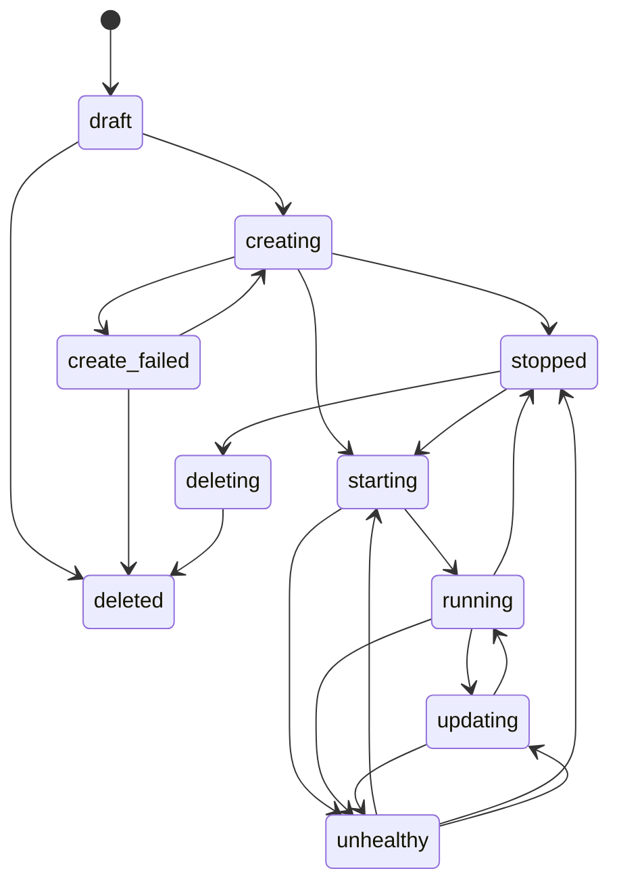
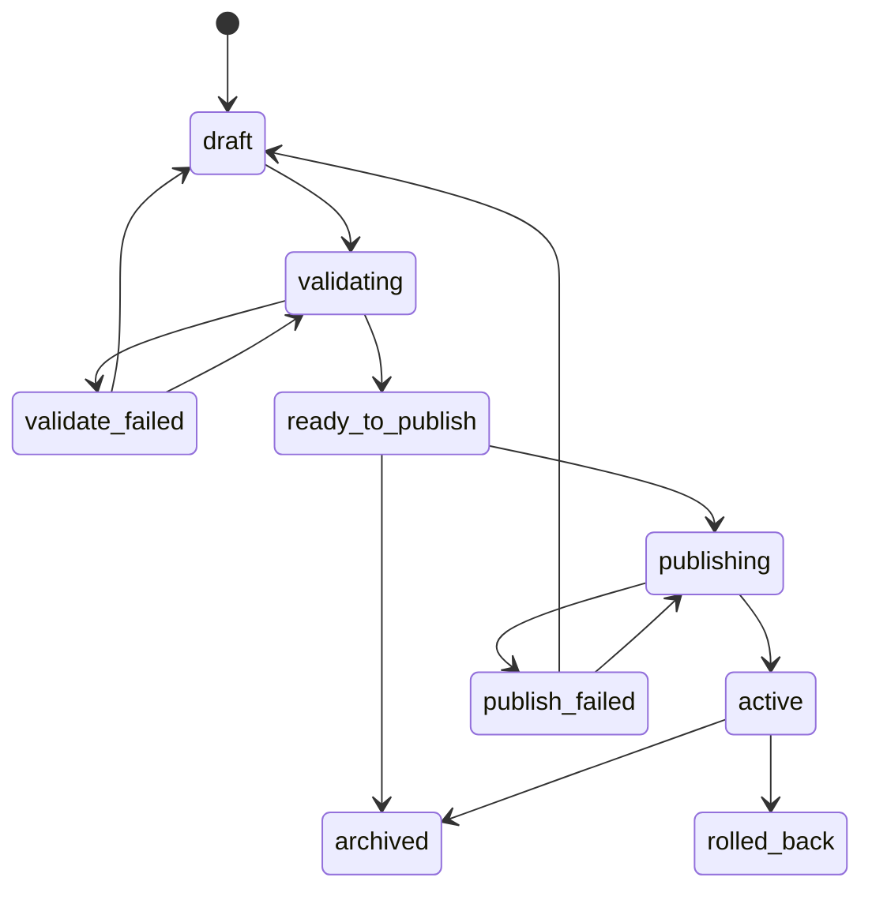
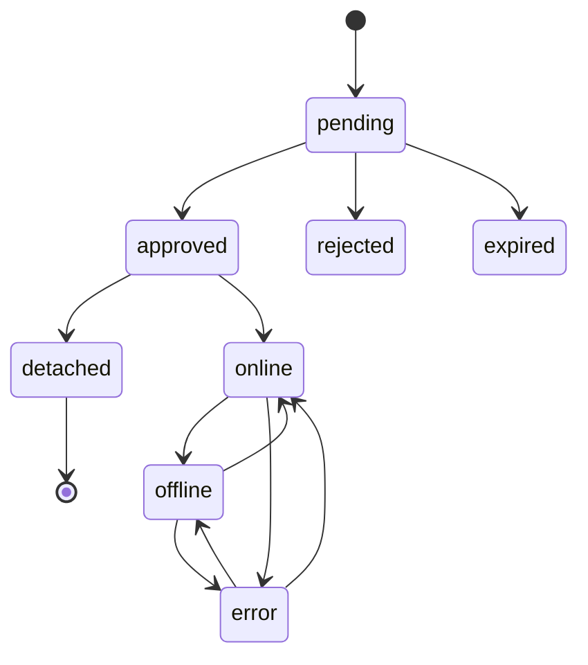
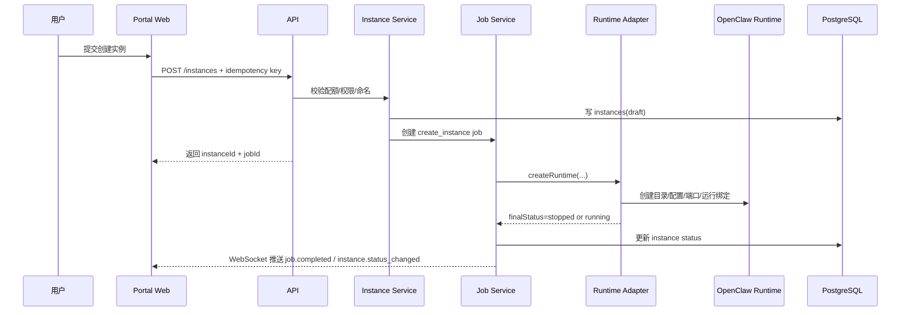
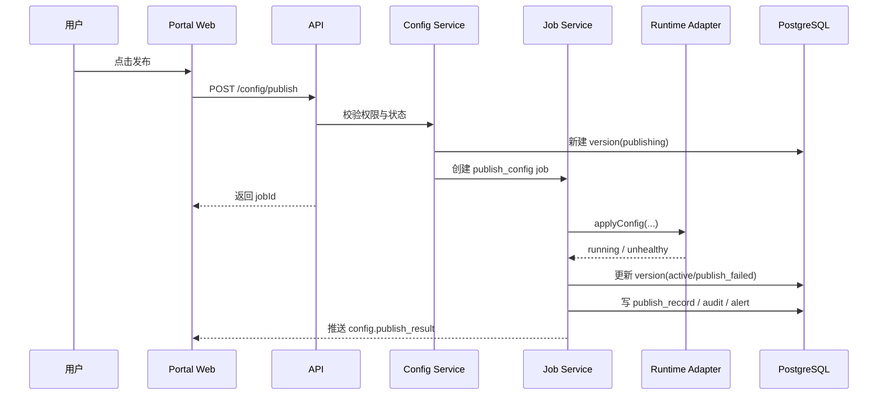
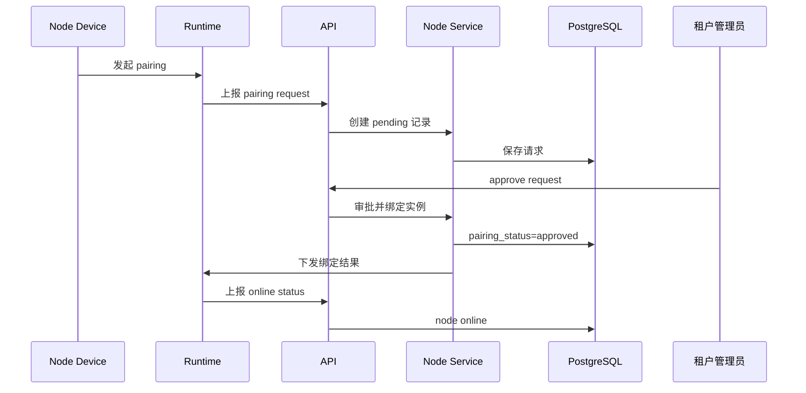

# Lobster Park / 龙虾乐园 补充文档 V1.2

- 文档类型：补充规范 / 状态机 / 术语 / RBAC / 时序图 / 低保真
- 对应 PRD：`LobsterPark_PRD_V1_2.md`
- 对应研发文档：`LobsterPark_Dev_Handoff_V1_2.md`
- 版本：V1.2
- 日期：2026-03-06

## 1. 评审闭环矩阵

| 评审问题 | 处理方式 | 落位文档 |
|---|---|---|
| 实例状态机不一致 | 统一为 10 状态并定义允许操作 | 本文 3.1 / PRD 11 / Dev 10 |
| 配置版本状态机不一致 | 统一命名 ready_to_publish / publishing / active | 本文 3.2 / PRD 11 / Dev 10 |
| 节点状态机不一致 | 采用双状态组并补充 error | 本文 3.3 / PRD 11 / Dev 10 |
| 模板中心阶段矛盾 | V1 保留模板选择，模板后台移到 V1.5 | PRD 6 / Dev 12 |
| 告警系统缺失 | 增加 alerts / notifications 表与 API | PRD 8.7 / Dev 8 / OpenAPI |
| NFR 缺失 | 补充性能、可用性、容量、保留、降级 | PRD 10 |
| 认证与安全方案缺失 | 补充 OIDC / JWT / Cookie / CSRF / CORS / 限流 | Dev 3 |
| 统一错误码缺失 | 定义 error code 范围与样例 | Dev 4.3 |
| 实时推送缺失 | 增加 WebSocket 事件协议 | Dev 5.1 |
| 幂等性缺失 | 增加 X-Idempotency-Key 机制 | Dev 4.4 |
| Runtime Adapter 缺契约 | 输出 TypeScript 接口 | Dev 6 |
| Job 重试与取消缺失 | 输出 timeout / retry / cancel 策略 | Dev 5.3 |
| 平台健康检查缺失 | 增加 /health /ready /metrics /info | Dev 11.3 |
| 术语表缺失 | 本文统一定义 | 本文 2 |
| 权限矩阵缺失 | 本文输出角色-权限矩阵 | 本文 4 |
| 架构图 / 时序图缺失 | 本文补 Mermaid 图 | 本文 5 |
| 低保真原型缺失 | 本文补关键页面 ASCII | 本文 6 |
| `instance_secrets` 表丢失 | Dev 补回密钥表并与 Runtime Adapter 的 `secretsRef` 对齐 | Dev 9.2 / OpenAPI 组件说明 |
| 通知 API 缺失 | 增加通知列表、未读数、已读、全部已读接口 | Dev 8.9 / OpenAPI paths |
| 租户级技能策略缺失 | 增加 `tenant_skill_policies` 数据模型并说明 V1 管理方式 | Dev 9.5 |
| `GET /config/current` 缺失 | 增加当前生效配置读取接口与 diff 方案 | PRD 8.4 / Dev 8.4 / OpenAPI paths |
| WebSocket payload 未定义 | 增加事件 payload 字段契约 | Dev 5.1 |
| 审计过滤参数缺失 | 在 Dev 与 OpenAPI 中补全查询参数 | Dev 8.7 / OpenAPI paths |
| 限流响应格式未定义 | 定义 429 / Retry-After / 错误体 | Dev 3.3 / OpenAPI components |
| `dirty_flag` 语义不清 | 明确由后端计算“草稿是否与当前 active 不一致” | Dev 9.3 |
| `force_publish` / break-glass 未串联 | 明确 `forcePublish=true` 需要 `config.force_publish` 权限并产生 P2 告警 | PRD 10.10 / Dev 8.4 / 本文 4 |

---

## 2. 术语表（Glossary）

| 术语 | 英文 | 定义 |
|---|---|---|
| 租户 | Tenant | 企业/组织级隔离单元 |
| 用户 | User | 平台登录主体 |
| 角色 | Role | 一组权限的聚合 |
| 实例 | Instance | 一个独立的 OpenClaw runtime |
| 运行绑定 | Runtime Binding | 实例与实际运行资源的绑定关系 |
| 草稿 | Config Draft | 未生效的可编辑配置 |
| 配置版本 | Config Version | 可校验、发布、回滚的配置快照 |
| 发布记录 | Publish Record | 一次发布/回滚动作的执行结果 |
| 节点 | Node | 接入实例的 companion 设备 |
| 配对申请 | Pairing Request | 节点申请接入实例的待审批记录 |
| 技能包 | Skill Package | 可被实例启用的技能来源包 |
| 模板 | Template | 创建实例时使用的一组预设配置 |
| 告警 | Alert | 由监控规则触发的事件 |
| 通知 | Notification | 告警、审批、任务等触发的消息分发结果 |
| 作业 / 任务 | Job | 异步后台执行单元 |
| 控制平面 | Control Plane | 龙虾乐园平台层 |
| 运行平面 | Runtime Plane | 实际运行的 OpenClaw 实例层 |

---

## 3. 统一状态机定义（唯一权威）

## 3.1 实例状态机

### 状态列表

| 状态 | 含义 | 允许操作 |
|---|---|---|
| draft | 元数据已建档，但运行绑定未完成 | 创建、删除 |
| creating | 创建中 | 查询进度、取消（部分阶段） |
| create_failed | 创建失败 | 重试创建、删除 |
| stopped | 已停止 | 启动、编辑配置、发布、删除 |
| starting | 启动中 | 查询进度 |
| running | 运行中 | 停止、重启、编辑配置、发布 |
| unhealthy | 运行异常 | 查看诊断、重启、停止、发布修复 |
| updating | 配置应用中 / reload / restart 中 | 查询进度 |
| deleting | 删除中 | 查询进度 |
| deleted | 已删除 | 恢复（保留期内） |

### 状态流转



### 规则
1. `create_failed` 表示资源创建/绑定失败；`unhealthy` 表示已运行实例异常，二者语义不可混用。
2. `creating / starting / updating / deleting` 时必须禁止重复的互斥写操作。
3. `deleted` 为软删除终态；彻底清理通过后台 purge job 完成。
4. 当 `autoStart=true` 时，创建成功后自动进入 `starting`；否则进入 `stopped`。

## 3.2 配置版本状态机

| 状态 | 含义 | 允许操作 |
|---|---|---|
| draft | 可编辑草稿版本 | 编辑、保存、发起校验、归档 |
| validating | 校验中 | 查询进度、取消 |
| validate_failed | 校验失败 | 继续编辑、再次校验、归档 |
| ready_to_publish | 校验通过，待发布 | 发布、归档 |
| publishing | 发布中 | 查询进度 |
| publish_failed | 发布失败 | 重新发布、回到草稿继续编辑 |
| active | 当前生效版本 | 查看、对比、作为回滚目标 |
| rolled_back | 被明确回滚掉的历史 active 版本 | 查看、对比 |
| archived | 非当前版本的历史归档版本 | 查看、对比 |



规则：
1. `ready_to_publish` 是唯一允许发布的入口状态。
2. `publish_failed` 不影响当前 active 版本。
3. 回滚实现为“从历史版本复制生成新版本并发布”，同时把被替换掉的旧 active 标记为 `rolled_back`。

## 3.3 节点状态机（双状态组）

### 3.3.1 配对状态 `pairing_status`

| 状态 | 含义 |
|---|---|
| pending | 待审批 |
| approved | 已批准，可进入绑定关系 |
| rejected | 已拒绝 |
| expired | 申请过期 |

### 3.3.2 在线状态 `online_status`

| 状态 | 含义 |
|---|---|
| online | 当前在线 |
| offline | 未在线但可恢复 |
| error | 节点通信或能力异常 |
| detached | 历史绑定后已解绑 |



规则：
1. 一个节点同一时刻只能绑定一个实例。
2. `rejected / expired` 是申请状态，不代表设备错误。
3. `detached` 代表历史绑定关系已解除，节点档案仍可保留。

---

## 4. RBAC 权限矩阵

### 4.1 权限分组

- tenant.view / tenant.manage
- user.view / user.manage
- role.view / role.manage
- instance.view / instance.create / instance.update / instance.delete / instance.start / instance.stop / instance.restart
- config.view / config.edit / config.validate / config.publish / config.rollback / config.force_publish
- node.view / node.approve / node.reject / node.detach
- skill.view / skill.enable / skill.disable / skill.review
- alert.view / alert.ack / alert.resolve
- audit.view
- monitor.view
- notification.view
- template.use / template.manage
- platform.settings.view / platform.settings.manage

### 4.2 角色-权限矩阵（核心）

| 权限 | 平台超级管理员 | 租户管理员 | 普通员工 | 安全/审计 |
|---|---|---|---|---|
| tenant.view | Y | Y | N | Y |
| tenant.manage | Y | Y | N | N |
| user.view | Y | Y | N | Y |
| user.manage | Y | Y | N | N |
| role.view | Y | Y | N | Y |
| role.manage | Y | Y | N | N |
| instance.view | Y | Y | Y（授权范围内） | Y |
| instance.create | Y | Y | Y | N |
| instance.update | Y | Y | Y（授权范围内） | N |
| instance.delete | Y | Y | 可选，不默认开放 | N |
| instance.start/stop/restart | Y | Y | Y（授权范围内） | N |
| config.view | Y | Y | Y（授权范围内） | Y |
| config.edit | Y | Y | Y（授权范围内） | N |
| config.validate | Y | Y | Y（授权范围内） | N |
| config.publish | Y | Y | Y（授权范围内） | N |
| config.rollback | Y | Y | 默认 N，可按实例授权 | N |
| config.force_publish | Y | 默认 N | N | N |
| node.view | Y | Y | Y（本人实例） | Y |
| node.approve/reject | Y | Y | N | N |
| node.detach | Y | Y | 默认 N | N |
| skill.view | Y | Y | Y | Y |
| skill.enable/disable | Y | Y | Y（白名单内） | N |
| skill.review | Y | 默认 N | N | Y（只读审核） |
| alert.view | Y | Y | Y（本人实例） | Y |
| alert.ack/resolve | Y | Y | 仅本人实例 P3/P4 告警 | Y（只读不操作可选） |
| audit.view | Y | Y | 本人实例可选 | Y |
| monitor.view | Y | Y | 本人实例 | Y |
| notification.view | Y | Y | 本人消息 | Y |
| template.use | Y | Y | Y | N |
| template.manage | Y | N（V1.5 可选） | N | N |
| platform.settings.view | Y | N | N | Y（只读可选） |
| platform.settings.manage | Y | N | N | N |

说明：`config.force_publish` 即 PRD 中的 break-glass 权限。调用配置发布接口时若 `forcePublish=true`，必须校验该权限、记录审计日志，并触发一条 P2 告警。

---

## 5. 架构图与关键时序图

## 5.1 创建实例时序



## 5.2 发布配置时序



## 5.3 节点配对时序



---

## 6. 低保真页面草图（ASCII）

## 6.1 实例概览页

```text
+----------------------------------------------------------------------------------+
| 实例名称  状态: running   健康: healthy   当前版本: v12   规格: M                |
| [启动] [停止] [重启] [编辑配置] [查看日志] [申请接入节点]                         |
+-------------------------------+-------------------------------+------------------+
| 基础信息                      | 最近告警                      | 节点摘要         |
| - owner                       | - P2 channel probe failed    | - online: 2      |
| - runtime version             | - P3 credential expiring     | - offline: 1     |
| - created at                  |                               |                  |
+-------------------------------+-------------------------------+------------------+
| 健康摘要                                                                       |
| runtime: healthy | channels: 3/4 ok | models: 2/2 ok | last check: 10:31     |
+----------------------------------------------------------------------------------+
| 最近操作 / 发布记录                                                             |
+----------------------------------------------------------------------------------+
```

## 6.2 配置中心

```text
+----------------------------------------------------------------------------------+
| 左侧导航            | 配置表单区域                           | 右侧结果区         |
| - 基础设置          | [字段A] [字段B]                        | 校验错误           |
| - 模型              | [字段C]                                | - path: ...        |
| - channel           | [Raw JSON 切换]                        | - 建议修复         |
| - agent             |                                        | 发布备注           |
| - skills            |                                        | 当前版本 diff      |
+----------------------------------------------------------------------------------+
| [保存草稿] [校验] [发布] [回滚]                                                  |
+----------------------------------------------------------------------------------+
```

## 6.3 告警中心

```text
+----------------------------------------------------------------------------------+
| 筛选：实例 / 严重级别 / 状态 / 时间                                              |
+----------------------------------------------------------------------------------+
| 告警标题              | 级别 | 状态  | 实例       | 首次触发      | 操作         |
| 健康检查失败          | P1   | open  | ins-a      | 10:15         | [确认][关闭] |
| channel probe 失败    | P2   | acked | ins-b      | 09:55         | [查看详情]   |
+----------------------------------------------------------------------------------+
| 详情抽屉：事件明细 / 通知记录 / 关联任务 / 审计                                  |
+----------------------------------------------------------------------------------+
```

---

## 7. 假设清单

1. V1 默认内部试点，单企业多租户模型先按可扩展方式实现。
2. 邮件系统可由企业 SMTP 或通知网关提供。
3. 监控快照与使用量由 Runtime Adapter 可拉取到基础数据。
4. OpenClaw 版本策略采用平台 allowlist 管理，不向普通用户开放任意版本选择。
5. 模板后台、企业 IM 通知不作为 V1 卡口项。

---

## 8. 一句话结论

本补充文档的作用是把“概念性 PRD”补成“真正可开工的权威规范”，尤其是：

**统一状态机、权限矩阵、关键时序、术语定义与页面轮廓。**
