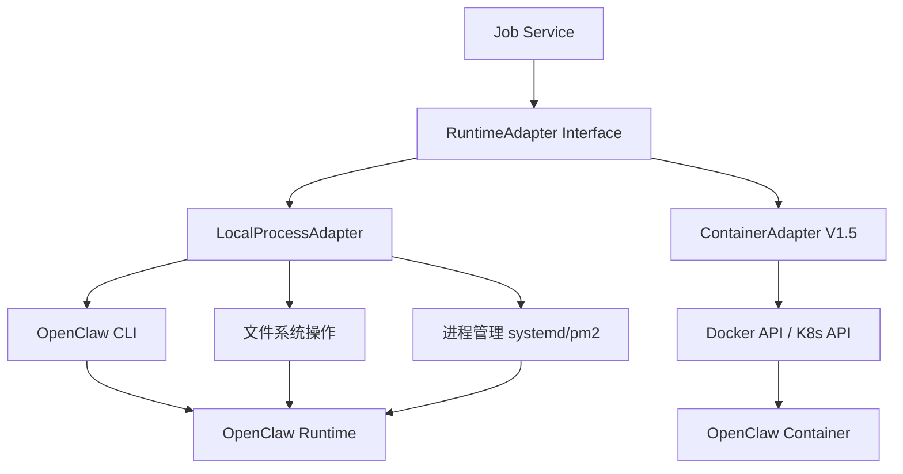
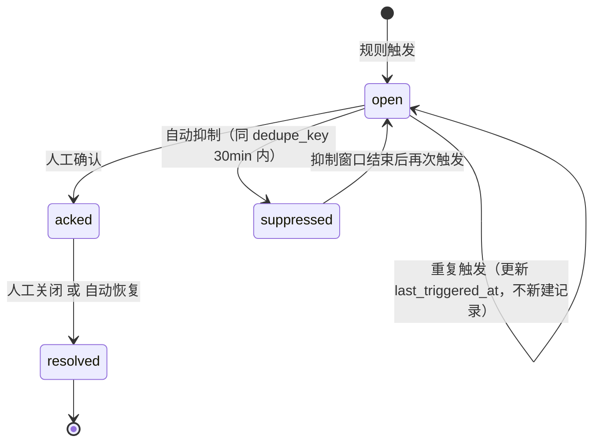
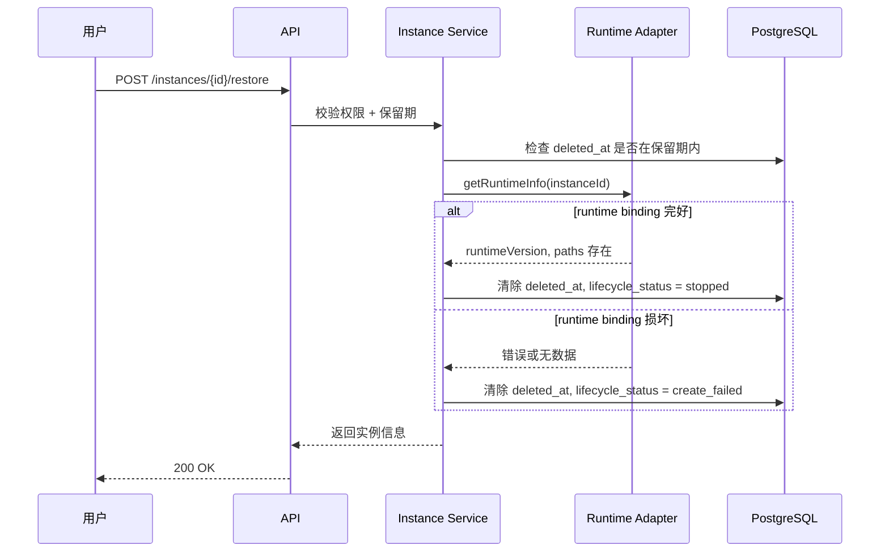
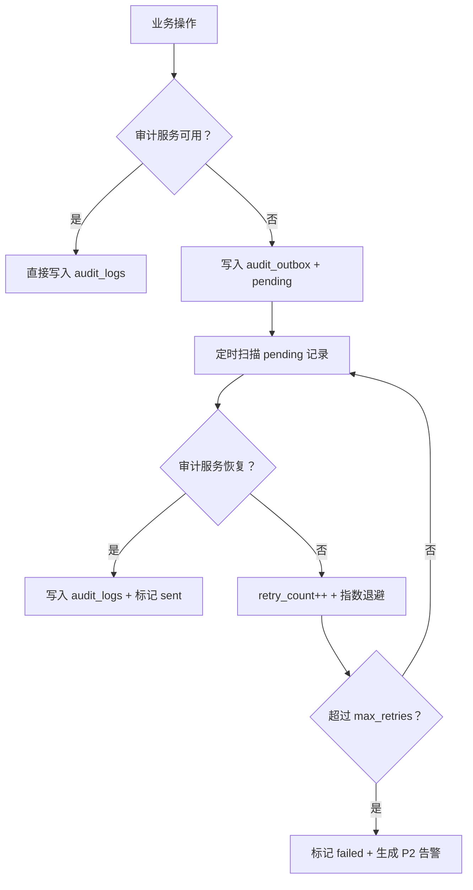

# Lobster Park / 龙虾乐园 技术预研与架构决策文档 V1.3

- 文档类型：Phase 0 技术预研产出 / 架构决策 / 开发阻塞项澄清
- 对应 PRD：`LobsterPark_PRD_V1_2.md`
- 对应研发文档：`LobsterPark_Dev_Handoff_V1_2.md`
- 对应补充文档：`LobsterPark_Supplement_V1_2.md`
- 对应 OpenAPI：`LobsterPark_OpenAPI_V1_2.yaml`
- 版本：V1.3
- 产出日期：2026-03-06
- 定位：解决 V1.2 评审后识别的全部开发阻塞项与摩擦项，使文档包达到可直接编码状态

---

## 0. 文档治理

### 0.1 变更历史

| 版本 | 日期 | 变更摘要 | 责任人 |
|---|---|---|---|
| V1.3 | 2026-03-06 | 基于 V1.2 开发就绪度评估，补齐 OIDC 登录流程、configJson 结构、Runtime Adapter 实现路径、部署架构决策、平台设置 API、WebSocket ticket、ID 策略、加密方案、告警规则、Job 队列、前端技术栈等全部遗留项 | ChatGPT |

### 0.2 本版关闭的关键问题

| # | 问题 | 分类 | 处理方式 |
|---|------|------|----------|
| 1 | OIDC 登录/回调端点缺失 | 🔴 阻塞 | 新增 SSO 登录流程与 API |
| 2 | configJson 结构完全不透明 | 🔴 阻塞 | 定义 OpenClaw 配置 schema 与示例 |
| 3 | Runtime Adapter 实现路径未说明 | 🔴 阻塞 | 定义 Adapter 通信方式与实现策略 |
| 4 | 服务部署架构未决定 | 🔴 阻塞 | 确定 V1 采用模块化单体 |
| 5 | 平台设置管理 API 缺失 | 🔴 阻塞 | 新增平台设置 API 与数据模型 |
| 6 | WebSocket ticket 签发端点缺失 | 🟡 摩擦 | 新增 ws ticket API |
| 7 | 实例元数据更新 API 缺失 | 🟡 摩擦 | 新增 PATCH instance API |
| 8 | 租户创建 API 缺失 | 🟡 摩擦 | 新增 POST tenant API + 种子策略 |
| 9 | ID 生成策略未规定 | 🟡 摩擦 | 统一采用 ULID |
| 10 | 密钥加密方案未指定 | 🟡 摩擦 | 定义 AES-256-GCM + 信封加密 |
| 11 | 告警规则/阈值定义未说明 | 🟡 摩擦 | 定义 V1 内置规则与阈值 |
| 12 | Job 队列实现选型未决定 | 🟡 摩擦 | 采用 Redis Stream |
| 13 | 实例恢复后目标状态未说明 | 🟡 摩擦 | 明确恢复后进入 stopped |
| 14 | 前端技术栈未指定 | 🟢 次要 | 确定 React + Ant Design |
| 15 | 内置模板 config_json 无示例 | 🟢 次要 | 提供 4 个模板示例 |
| 16 | 监控采集频率未说明 | 🟢 次要 | 定义采集周期 |
| 17 | 使用量日报聚合时机未说明 | 🟢 次要 | 定义聚合策略 |
| 18 | 审计 outbox 表缺失 | 🟢 次要 | 补充 outbox 表结构 |

### 0.3 权威来源

本文档作为 V1.2 的增量补充，权威层级位于 `LobsterPark_Supplement_V1_2.md` 之后、`LobsterPark_Dev_Handoff_V1_2.md` 之前。

本文内容与 Dev Handoff V1.2 发生冲突时，以本文为准（因为本文是对 V1.2 遗留项的显式决策）。

---

## 1. OIDC 登录流程与端点

### 1.1 SSO 登录时序

```mermaid
sequenceDiagram
    participant U as 用户浏览器
    participant W as Portal Web (SPA)
    participant A as API Server
    participant IdP as OIDC Provider

    U->>W: 访问 /login
    W->>A: GET /api/v1/auth/sso/authorize?redirect_uri=...
    A->>A: 生成 state + code_verifier + code_challenge (PKCE S256)
    A->>A: 将 state ↔ code_verifier 存入 Redis（TTL 10 min）
    A-->>U: 302 重定向到 IdP authorization_endpoint
    U->>IdP: 用户登录并授权
    IdP-->>U: 302 重定向到 /api/v1/auth/sso/callback?code=xxx&state=yyy
    U->>A: GET /api/v1/auth/sso/callback?code=xxx&state=yyy
    A->>A: 校验 state，取出 code_verifier
    A->>IdP: POST token_endpoint (code + code_verifier)
    IdP-->>A: id_token + access_token
    A->>A: 验证 id_token 签名、nonce、aud、iss
    A->>A: 提取 sub / email / name，执行用户匹配或自动注册
    A->>A: 签发平台 JWT (access 15min + refresh 7d)
    A-->>U: Set-Cookie: lp_access=<jwt>; lp_refresh=<refresh>; 302 → /workbench
```

### 1.2 新增 API

#### `GET /api/v1/auth/sso/authorize`

发起 SSO 登录。

| 参数 | 类型 | 必填 | 说明 |
|------|------|------|------|
| redirect_uri | string | 否 | 登录成功后跳转的前端页面，默认 `/workbench` |

响应：`302` 重定向到 IdP 的 `authorization_endpoint`。

#### `GET /api/v1/auth/sso/callback`

IdP 授权回调。

| 参数 | 类型 | 必填 | 说明 |
|------|------|------|------|
| code | string | 是 | IdP 返回的 authorization code |
| state | string | 是 | 防 CSRF 的状态参数 |

响应：
- 成功：`302` 重定向到 `redirect_uri`，同时 Set-Cookie 设置 `lp_access` 和 `lp_refresh`
- 失败：`302` 重定向到 `/login?error=sso_failed&code=10003`

### 1.3 用户自动注册（JIT Provisioning）策略

| 策略 | 说明 |
|------|------|
| 默认策略 | V1 采用 **自动注册**：SSO 登录成功但平台无对应用户记录时，自动在默认租户下创建用户并赋予“普通员工”角色 |
| 匹配规则 | 以 IdP 返回的 `email` 为唯一标识匹配 `users.email` |
| 租户归属 | 自动注册用户归属到系统默认租户（由平台设置 `default_tenant_id` 控制） |
| 管理员用户 | 平台超级管理员和租户管理员必须由现有管理员通过 `POST /tenants/{tenantId}/users` 手动创建并赋权，不可通过 JIT 自动获取管理权限 |
| 可选关闭 | 平台设置 `jit_provisioning_enabled` 可关闭自动注册；关闭后未预创建的用户登录将被拒绝（返回 10004 错误） |
| 审计 | 自动注册必须落审计（action_type: `user.auto_registered`） |

### 1.4 IdP 配置要求

| 配置项 | V1 默认值 / 要求 |
|--------|-----------------|
| OIDC Discovery URL | 通过环境变量 `OIDC_ISSUER_URL` 配置，平台启动时自动获取 `.well-known/openid-configuration` |
| Client ID | 环境变量 `OIDC_CLIENT_ID` |
| Client Secret | V1 使用 PKCE（public client），不需要 `client_secret`；若企业 IdP 不支持 PKCE，可降级为 confidential client + `OIDC_CLIENT_SECRET` |
| Scopes | `openid profile email` |
| 回调 URL | `{PLATFORM_BASE_URL}/api/v1/auth/sso/callback` |
| 支持的 IdP | Keycloak（推荐）、Azure AD、Okta、Auth0、Casdoor |
| Token 签名验证 | 从 IdP 的 JWKS endpoint 获取公钥验证 id_token 签名 |

### 1.5 新增错误码

| 错误码 | 说明 |
|--------|------|
| 10003 | SSO 回调失败（code 无效、state 不匹配、IdP 不可达） |
| 10004 | 用户未注册且 JIT 已关闭 |
| 10005 | 用户已被禁用（status=disabled） |

---

## 2. configJson 结构定义

### 2.1 OpenClaw 配置 Schema 概览

OpenClaw 的配置文件本质是一个 JSON/YAML 文档，龙虾乐园将其存储为 `configJson: Record<string, unknown>`。以下定义 V1 平台需要理解的配置结构。

```json
{
  "$schema": "openclaw-config-v1",
  "general": {
    "name": "string           -- 实例显示名称",
    "description": "string    -- 实例描述",
    "language": "string       -- 默认语言，如 zh-CN、en",
    "timezone": "string       -- 时区，如 Asia/Shanghai"
  },
  "models": [
    {
      "id": "string           -- 模型唯一标识",
      "provider": "string     -- 提供商：openai / azure / anthropic / custom",
      "modelName": "string    -- 模型名称：gpt-4o / claude-3-sonnet / ...",
      "apiEndpoint": "string  -- API 端点 URL",
      "apiKeyRef": "string    -- 引用 instance_secrets 中的 secret_key",
      "maxTokens": "number    -- 单次最大 token 数",
      "temperature": "number  -- 温度参数 0.0~2.0",
      "enabled": "boolean     -- 是否启用"
    }
  ],
  "channels": [
    {
      "id": "string           -- Channel 唯一标识",
      "type": "string         -- 类型：web / api / wechat / dingtalk / feishu / slack",
      "name": "string         -- 显示名称",
      "enabled": "boolean",
      "config": {
        "...": "...           -- 各类型特有配置，如 webhook URL、app ID 等"
      },
      "boundModelId": "string -- 绑定的默认模型 ID",
      "rateLimit": {
        "maxRequestsPerMinute": "number",
        "maxConcurrentSessions": "number"
      }
    }
  ],
  "agents": [
    {
      "id": "string           -- Agent 唯一标识",
      "name": "string         -- 显示名称",
      "systemPrompt": "string -- 系统提示词",
      "modelId": "string      -- 使用的模型 ID",
      "enabled": "boolean",
      "maxTurns": "number     -- 最大对话轮数",
      "tools": ["string"]
    }
  ],
  "skills": [
    {
      "packageId": "string    -- 技能包 ID（对应 skill_packages.id）",
      "enabled": "boolean",
      "config": {
        "...": "...           -- 技能特有配置"
      }
    }
  ],
  "security": {
    "contentFilter": {
      "enabled": "boolean",
      "level": "string        -- strict / moderate / permissive"
    },
    "inputMaxLength": "number -- 单次输入最大字符数",
    "outputMaxLength": "number",
    "allowFileUpload": "boolean",
    "maxFileSize": "number    -- 单位 MB",
    "allowedFileTypes": ["string"]
  },
  "advanced": {
    "...": "...               -- Raw JSON 兜底区域，平台不做结构化表单"
  }
}
```

### 2.2 Schema 获取方式

| 方式 | 说明 |
|------|------|
| 内置 Schema | V1 平台内置与 `supported_runtime_versions` 对应的 JSON Schema 文件（每个 runtime 大版本对应一份） |
| Schema 存储 | 存放于代码仓库 `resources/schemas/openclaw-config-{major_version}.json` |
| Schema 加载 | 平台启动时加载到内存；前端通过 `GET /api/v1/platform/schemas/{runtimeVersion}` 获取 |
| Schema 版本关联 | `instance_config_drafts.schema_version` 记录当前草稿使用的 schema 版本 |
| 版本升级 | runtime 版本升级时，config-service 负责检测 schema 差异并提示用户需要迁移的字段 |

### 2.3 结构化表单 vs Raw JSON 的映射

| configJson section | V1 表单化 | 说明 |
|-------------------|----------|------|
| `general` | ✅ 完全表单化 | 基础设置 tab |
| `models` | ✅ 完全表单化 | 模型管理 tab，`apiKeyRef` 使用密钥选择器 |
| `channels` | ✅ 基础字段表单化 | channel 管理 tab，`config` 子对象使用 JSON 编辑器 |
| `agents` | ✅ 完全表单化 | agent 管理 tab，`systemPrompt` 使用富文本编辑器 |
| `skills` | ⚠️ 半表单化 | 列表展示启用/禁用，`config` 使用 JSON 编辑器 |
| `security` | ✅ 完全表单化 | 安全设置 tab |
| `advanced` | ❌ 纯 JSON | Raw JSON 编辑器，平台不解析 |

### 2.4 密钥引用规则

configJson 中不直接存储密钥明文。凡需要密钥的字段（如 `models[].apiKeyRef`）存储的是 `instance_secrets` 表中的 `secret_key` 值。

```text
configJson.models[0].apiKeyRef = "openai_api_key"
                                      ↓ 引用
instance_secrets: { secret_key: "openai_api_key", cipher_value: "enc:xxx", masked_preview: "sk-****7890" }
```

Runtime Adapter 在 `applyConfig` 时接收 `secretsRef: string[]`，adapter 实现负责将 `secret_key` 解析为实际密文注入到运行时配置中。

### 2.5 configJson 校验规则

校验由 Runtime Adapter 的 `validateConfig()` 执行，但平台侧在调用 Adapter 前先做基础前置校验：

| 校验层 | 检查内容 |
|--------|----------|
| 平台前置校验 | JSON 格式合法、顶级 section 存在、必填字段非空、`apiKeyRef` 引用的 `secret_key` 存在于 `instance_secrets` 表 |
| Adapter 校验 | schema 合规性、模型可达性（可选）、channel 配置完整性、agent 引用的 `modelId` 存在、技能包存在且在白名单中 |

---

## 3. Runtime Adapter 实现路径

### 3.1 通信方式决策

| 方案 | V1 决策 |
|------|---------|
| **CLI 命令封装** | ✅ V1 采用。Adapter 通过 `child_process` 调用 OpenClaw CLI 完成实例管理 |
| HTTP API | V1.5 考虑。待 OpenClaw 提供稳定的 HTTP 管理接口后迁移 |
| gRPC | V2 考虑。高性能场景 |
| 直接文件操作 | 仅作为 CLI 的补充（如读取配置文件、日志文件） |

### 3.2 Adapter 实现架构



### 3.3 LocalProcessAdapter 实现细节

V1 默认采用 `LocalProcessAdapter`，以进程级隔离运行 OpenClaw：

```ts
export class LocalProcessAdapter implements RuntimeAdapter {

  // 核心命令映射
  private readonly commands = {
    create:    'openclaw init --config {configPath} --workspace {workspacePath}',
    start:     'openclaw start --workspace {workspacePath} --port {port} --daemon',
    stop:      'openclaw stop --workspace {workspacePath}',
    restart:   'openclaw restart --workspace {workspacePath}',
    destroy:   'openclaw destroy --workspace {workspacePath} {--purge}',
    validate:  'openclaw config validate --config {configPath}',
    reload:    'openclaw config reload --workspace {workspacePath}',
    health:    'openclaw status --workspace {workspacePath} --format json',
    usage:     'openclaw metrics --workspace {workspacePath} --from {from} --to {to} --format json',
    nodes:     'openclaw nodes list --workspace {workspacePath} --format json',
    info:      'openclaw info --workspace {workspacePath} --format json',
  };

  // 目录结构规范
  // 基础路径由平台设置 `runtime_base_path` 控制，默认 /opt/lobster-park/runtimes
  // 每个实例的目录结构：
  //   {runtime_base_path}/{instance_id}/
  //   ├── config/          -- configPath
  //   ├── workspace/       -- workspacePath
  //   ├── state/           -- statePath
  //   ├── logs/            -- logPath
  //   └── secrets/         -- 运行时密钥注入目录（仅 Adapter 可写）
}
```

### 3.4 Adapter 通信协议

| 操作 | CLI 命令 | 输出解析 | 错误处理 |
|------|---------|---------|---------|
| createRuntime | `openclaw init` + 端口分配 + 写配置文件 | 解析 JSON stdout → bindingId, portBindings, paths | exit code ≠ 0 → 解析 stderr → 映射到平台错误码 |
| startRuntime | `openclaw start --daemon` | 检查进程 PID → 健康探活 → finalStatus | 启动超时 → unhealthy |
| stopRuntime | `openclaw stop` → 等待进程退出 | 确认进程不存在 → stopped | SIGTERM → 等待 30s → SIGKILL |
| applyConfig | 写配置文件 → `openclaw config reload` 或 `openclaw restart` | 探活确认 → running/unhealthy | reload 失败不回滚文件，由 Job 标记 publish_failed |
| validateConfig | `openclaw config validate` | 解析 JSON → errors[] + warnings[] | 超时 → 返回校验失败 |
| getHealthStatus | `openclaw status --format json` | 解析 JSON → runtimeStatus, channelStatuses, ... | 进程不存在 → stopped |

### 3.5 隔离模式说明

| 模式 | 实现方式 | V1 状态 |
|------|---------|---------|
| `process` | 独立系统进程 + 独立目录 + 独立端口 + 文件权限隔离（每实例一个 OS 用户或使用 namespace） | ✅ V1 默认 |
| `container` | 每实例一个 Docker 容器，通过 Docker API 管理生命周期，网络与存储隔离 | ⚠️ V1.5 实现 ContainerAdapter |

### 3.6 `secretsRef` 引用规则

```text
secretsRef: string[]
```

- 数组中每个元素对应 `instance_secrets.secret_key`
- Adapter 实现在执行 `createRuntime` 或 `applyConfig` 前，从 `instance_secrets` 表解密出明文
- 明文写入实例隔离目录下的 `secrets/` 文件夹（文件权限 0600，仅 runtime 用户可读）
- 运行时配置中的 `apiKeyRef` 字段在注入时被替换为实际密钥值
- Adapter 不在日志中输出任何密钥明文

### 3.7 端口分配策略

| 配置项 | 默认值 |
|--------|--------|
| 端口范围 | 10000 ~ 19999 |
| 分配方式 | 从 `instance_runtime_bindings.port_bindings_json` 已占用端口中排除后，顺序分配下一个可用端口 |
| 每实例端口数 | 2 个（HTTP API 端口 + WebSocket 端口） |
| 端口释放 | 实例删除并 purge 后释放 |

### 3.8 Adapter 错误映射

| CLI exit code / 异常 | 平台错误码 | 说明 |
|---------------------|-----------|------|
| exit 1 + "port in use" | 30004 | 端口冲突 |
| exit 1 + "config invalid" | 40001 | 配置校验失败 |
| exit 1 + "version not supported" | 30005 | 运行时版本不支持 |
| exit 1 + "workspace exists" | 30006 | 工作区已存在 |
| exit 1 + "process not found" | 30007 | 运行时进程不存在 |
| 进程超时（无响应） | 80001 | 操作超时 |
| 未知错误 | 90001 | 内部错误 |

---

## 4. 服务部署架构

### 4.1 V1 架构决策：模块化单体（Modular Monolith）

V1 采用 **模块化单体** 架构，原因：

1. V1 试点规模小（200 用户、300 实例、150 RPS），微服务的运维复杂度不值得
2. 11 个服务模块仍然保持代码层面的边界（独立包/模块、接口隔离），但编译部署为单一可执行体
3. 未来如需拆分微服务，只需将模块独立部署并将内部调用改为 HTTP/gRPC

### 4.2 工程结构

```text
lobster-park/
├── apps/
│   ├── server/                    -- 后端单体应用
│   │   ├── src/
│   │   │   ├── modules/
│   │   │   │   ├── auth/          -- auth-service 模块
│   │   │   │   ├── tenant/        -- tenant-user-rbac-service 模块
│   │   │   │   ├── instance/      -- instance-service 模块
│   │   │   │   ├── config/        -- config-service 模块
│   │   │   │   ├── node/          -- node-service 模块
│   │   │   │   ├── monitor/       -- monitor-service 模块
│   │   │   │   ├── alert/         -- alert-service 模块
│   │   │   │   ├── audit/         -- audit-service 模块
│   │   │   │   ├── notification/  -- notification-service 模块
│   │   │   │   ├── job/           -- job-service 模块
│   │   │   │   └── platform/      -- platform-settings 模块
│   │   │   ├── adapter/
│   │   │   │   ├── runtime-adapter.ts          -- 接口定义
│   │   │   │   ├── local-process-adapter.ts    -- V1 默认实现
│   │   │   │   └── container-adapter.ts        -- V1.5 实现
│   │   │   ├── common/
│   │   │   │   ├── middleware/    -- 鉴权、RBAC、限流、CSRF、审计中间件
│   │   │   │   ├── errors/        -- 统一错误码与错误处理
│   │   │   │   ├── database/      -- 数据库连接、迁移
│   │   │   │   └── redis/         -- Redis 连接、队列
│   │   │   └── main.ts
│   │   ├── resources/
│   │   │   ├── schemas/           -- OpenClaw 配置 JSON Schema
│   │   │   ├── migrations/        -- Prisma 迁移文件
│   │   │   └── templates/         -- 内置模板 JSON
│   │   └── package.json
│   └── web/                       -- 前端 SPA
│       ├── src/
│       │   ├── pages/
│       │   ├── components/
│       │   ├── stores/
│       │   ├── api/               -- 基于 OpenAPI 生成的 API client
│       │   └── utils/
│       └── package.json
├── packages/
│   └── shared/                    -- 前后端共享类型定义
│       ├── types/
│       └── constants/
└── package.json                   -- monorepo root (pnpm workspace)
```

### 4.3 后端技术选型

| 维度 | 选型 | 理由 |
|------|------|------|
| 语言 | TypeScript (Node.js) | 与 Runtime Adapter 契约一致；前后端统一语言 |
| 框架 | NestJS | 模块化架构天然适配；内置 DI、Guard、Interceptor |
| ORM | Prisma | 类型安全、迁移管理、与 TypeScript 生态匹配 |
| 数据库 | PostgreSQL 15+ | 支持 JSONB、分区表、LISTEN/NOTIFY |
| 缓存/队列 | Redis 7+ | 会话、幂等缓存、限流计数、Job 队列 |
| 迁移 | Prisma Migrate | 与 Prisma ORM 原生集成 |
| 进程管理 | PM2 | OpenClaw 实例进程的守护与监控 |
| 日志 | Pino | 结构化 JSON 日志，性能优秀 |
| API 文档 | 基于 OpenAPI V1.3 生成 | NestJS Swagger 插件自动同步 |

### 4.4 模块间调用规范

```ts
// 模块间通过接口调用，不直接引用实现类

export interface IConfigService {
  getCurrentActiveVersion(instanceId: string): Promise<ConfigVersion | null>;
  createDraftFromTemplate(instanceId: string, templateId: string): Promise<void>;
}
```

规则：
1. 模块间只通过接口调用，不直接引用其他模块的 Repository 或 Entity
2. 跨模块数据查询通过服务接口，不直接 JOIN 其他模块的表
3. 事务仅限模块内部；跨模块操作通过 Saga / Event 保证最终一致性

---

## 5. 平台设置管理

### 5.1 数据模型

新增 `platform_settings` 表：

```text
platform_settings
├── id                  -- ULID
├── setting_key         -- 唯一键，如 'resource_specs', 'runtime_versions', 'default_policies'
├── setting_value_json  -- JSONB，设置值
├── description         -- 设置说明
├── updated_by          -- 最后更新人
├── updated_at
├── created_at
```

### 5.2 预定义设置项

| setting_key | 说明 | 默认值 |
|-------------|------|--------|
| `resource_specs` | 资源规格定义 | `[{"code":"S","vcpu":1,"memoryGiB":1,"diskGiB":10,"maxSessions":3},{"code":"M","vcpu":2,"memoryGiB":2,"diskGiB":20,"maxSessions":10},{"code":"L","vcpu":4,"memoryGiB":4,"diskGiB":40,"maxSessions":20}]` |
| `runtime_versions` | 版本策略 | `{"approved":"2026.2.1","supported":["2026.2.0","2026.2.1"],"blocked":[]}` |
| `default_tenant_id` | 默认租户 ID（JIT 注册使用） | 系统初始化时创建的第一个租户 ID |
| `jit_provisioning_enabled` | 是否开启 SSO 自动注册 | `true` |
| `runtime_base_path` | OpenClaw 运行时基础路径 | `/opt/lobster-park/runtimes` |
| `port_range` | 端口分配范围 | `{"min":10000,"max":19999}` |
| `notification_throttle_minutes` | 通知节流窗口（分钟） | `30` |
| `soft_delete_retention_days` | 软删除保留天数 | `7` |
| `max_config_versions` | 热存储配置版本数 | `50` |
| `alert_rules` | V1 内置告警规则 | 见第 9 节 |

### 5.3 新增 API

#### `GET /api/v1/platform/settings`

获取所有平台设置（需要 `platform.settings.view` 或 `platform.settings.manage` 权限）。

响应示例：

```json
{
  "requestId": "req_01HQ...",
  "code": 0,
  "message": "ok",
  "data": {
    "items": [
      {
        "settingKey": "resource_specs",
        "settingValueJson": [],
        "description": "资源规格定义",
        "updatedBy": "user_001",
        "updatedAt": "2026-03-06T10:00:00Z"
      }
    ]
  }
}
```

#### `GET /api/v1/platform/settings/{settingKey}`

获取单个设置项。

#### `PUT /api/v1/platform/settings/{settingKey}`

更新单个设置项（需要 `platform.settings.manage` 权限）。

请求体：

```json
{
  "settingValueJson": {}
}
```

规则：
1. 变更必须落审计（action_type: `platform.settings.updated`）
2. `runtime_versions` 变更时，需校验是否有运行中实例使用即将 blocked 的版本，如有则返回警告但不阻止
3. `resource_specs` 删除某个规格时，需校验是否有实例正在使用该规格

#### `GET /api/v1/platform/schemas/{runtimeVersion}`

获取指定 runtime 版本对应的 OpenClaw 配置 JSON Schema。

响应：直接返回 JSON Schema 文档。

---

## 6. 补充 API

### 6.1 WebSocket Ticket 签发

#### `POST /api/v1/ws/ticket`

签发一次性 WebSocket 握手票据。

响应：

```json
{
  "requestId": "req_01HQ...",
  "code": 0,
  "message": "ok",
  "data": {
    "ticket": "ws_01HQ...",
    "expiresIn": 30
  }
}
```

规则：
1. ticket 存入 Redis，TTL 30 秒
2. 使用后立即失效（一次性）
3. 每个用户同时最多 3 个有效 ticket
4. WebSocket 握手 URL：`/ws/v1/events?ticket={ticket}`

### 6.2 实例元数据更新

#### `PATCH /api/v1/instances/{instanceId}`

更新实例基本信息（需要 `instance.update` 权限）。

请求体：

```json
{
  "name": "新名称（可选）",
  "description": "新描述（可选）"
}
```

规则：
1. 实例名称唯一性范围：**同一租户内唯一**
2. `deleting` / `deleted` 状态的实例不允许更新
3. 变更落审计

### 6.3 租户管理

#### `POST /api/v1/tenants`

创建租户（需要 `tenant.manage` 权限，仅平台超级管理员可用）。

请求体：

```json
{
  "name": "租户名称",
  "quotaJson": {
    "maxInstances": 200,
    "maxUsers": 100,
    "maxNodes": 500
  }
}
```

#### `PATCH /api/v1/tenants/{tenantId}`

更新租户信息。

请求体：

```json
{
  "name": "新名称（可选）",
  "status": "active | suspended（可选）",
  "quotaJson": {}
}
```

### 6.4 系统初始化（种子数据）

平台首次部署时，通过迁移脚本或初始化命令创建：

1. 默认租户（`default`）
2. 平台超级管理员用户（email 从环境变量 `ADMIN_EMAIL` 读取）
3. 4 个预定义角色（`platform_admin` / `tenant_admin` / `employee` / `auditor`）
4. 角色-权限关联（按 Supplement V1.2 RBAC 矩阵）
5. 全部 `platform_settings` 默认值
6. 4 个内置模板

初始化命令：

```bash
npx lobster-park seed --admin-email admin@company.com
```

---

## 7. ID 生成策略

### 7.1 策略决策

V1 统一采用 **ULID**（Universally Unique Lexicographically Sortable Identifier）。

理由：
1. 时间有序，可作为自然排序依据
2. 128-bit 无冲突风险
3. 比 UUID v4 更短且可读性更好
4. URL-safe（全大写字母 + 数字，26 字符）
5. 不依赖数据库序列，适配未来分布式拆分

### 7.2 格式规范

| 对象 | ID 前缀 | 示例 |
|------|---------|------|
| Tenant | `tnt_` | `tnt_01HQ3V5KPXZA0WJQY6` |
| User | `usr_` | `usr_01HQ3V5KPXZA0WJQY7` |
| Role | `rol_` | `rol_01HQ3V5KPXZA0WJQY8` |
| Instance | `ins_` | `ins_01HQ3V5KPXZA0WJQY9` |
| Config Version | `cfv_` | `cfv_01HQ3V5KPXZA0WJQYA` |
| Config Draft | `cfd_` | `cfd_01HQ3V5KPXZA0WJQYB` |
| Node | `nod_` | `nod_01HQ3V5KPXZA0WJQYC` |
| Pairing Request | `prq_` | `prq_01HQ3V5KPXZA0WJQYD` |
| Alert | `alt_` | `alt_01HQ3V5KPXZA0WJQYE` |
| Notification | `ntf_` | `ntf_01HQ3V5KPXZA0WJQYF` |
| Audit Log | `aud_` | `aud_01HQ3V5KPXZA0WJQYG` |
| Job | `job_` | `job_01HQ3V5KPXZA0WJQYH` |
| Skill Package | `skl_` | `skl_01HQ3V5KPXZA0WJQYI` |
| Template | `tpl_` | `tpl_01HQ3V5KPXZA0WJQYJ` |
| Platform Setting | `pst_` | `pst_01HQ3V5KPXZA0WJQYK` |
| Secret | `sec_` | `sec_01HQ3V5KPXZA0WJQYL` |
| Runtime Binding | `rtb_` | `rtb_01HQ3V5KPXZA0WJQYM` |

### 7.3 数据库列类型

所有 `id` 列使用 `VARCHAR(30)`，索引类型为 `PRIMARY KEY`。

---

## 8. 密钥加密方案

### 8.1 加密算法

| 配置项 | V1 决策 |
|--------|---------|
| 对称加密算法 | AES-256-GCM |
| 密钥派生 | 不使用 KDF；直接使用 32 字节主密钥 |
| IV | 每次加密随机生成 12 字节 IV |
| 密文格式 | `enc:v1:{base64(iv)}:{base64(ciphertext)}:{base64(authTag)}` |

### 8.2 密钥管理

| 维度 | V1 方案 | V1.5 可升级到 |
|------|---------|--------------|
| 主密钥存储 | 环境变量 `SECRET_MASTER_KEY`（64 字符 hex 编码的 32 字节密钥） | HashiCorp Vault / AWS KMS |
| 信封加密 | V1 简化方案：直接使用主密钥加密每条 secret | V1.5 引入数据密钥（DEK），用主密钥（KEK）加密 DEK |
| 密钥轮转 | V1 不支持在线轮转；更换主密钥需离线重加密所有密文 | V1.5 支持双密钥并行解密迁移 |

### 8.3 加解密流程

```text
写入 secret:
  plaintext → AES-256-GCM(masterKey, randomIV) → "enc:v1:{iv}:{ciphertext}:{tag}"
  同时生成 masked_preview: 取明文前 2 字符 + "****" + 后 4 字符

读取 secret（Adapter 注入时）:
  "enc:v1:{iv}:{ciphertext}:{tag}" → 解析 → AES-256-GCM-Decrypt(masterKey, iv, ciphertext, tag) → plaintext

API 返回 secret:
  仅返回 { secret_key, masked_preview, secret_version, updated_at }
  绝不返回 cipher_value 或明文
```

---

## 9. 告警规则定义

### 9.1 V1 内置告警规则

| 规则 ID | 告警场景 | 检测方式 | 阈值 | 级别 | dedupe_key 格式 |
|---------|---------|---------|------|------|----------------|
| `RULE_HEALTH_CHECK_FAIL` | 健康检查失败 | monitor-service 定期探活 | 连续 2 次探活失败 | P1 | `health_fail:{instanceId}` |
| `RULE_CHANNEL_PROBE_FAIL` | Channel probe 失败 | 健康检查中 channelStatuses | 任一 channel status ≠ `ok` | P2 | `channel_fail:{instanceId}:{channelId}` |
| `RULE_NODE_OFFLINE` | 节点长时间离线 | node-service 心跳检测 | 最后心跳 > 10 分钟 | P3 | `node_offline:{nodeId}` |
| `RULE_CREDENTIAL_EXPIRING` | 凭证即将过期 | 定期扫描 instance_secrets | 距过期 < 7 天 | P3 | `cred_expiring:{instanceId}:{secretKey}` |
| `RULE_PUBLISH_FAILED` | 配置发布失败 | Job 完成回调 | 发布 Job 状态 = `failed` | P2 | `publish_fail:{instanceId}:{versionId}` |
| `RULE_CREATE_FAILED` | 实例创建失败 | Job 完成回调 | 创建 Job 状态 = `failed` | P2 | `create_fail:{instanceId}` |
| `RULE_FREQUENT_RESTART` | 实例频繁重启 | 统计 restart Job 频次 | 30 分钟内 ≥ 3 次 | P2 | `frequent_restart:{instanceId}` |

### 9.2 告警生命周期



### 9.3 告警去重规则

1. 新告警触发时，先查找同 `dedupe_key` 且状态为 `open` 或 `acked` 的记录
2. 如果存在，更新 `last_triggered_at`，不新建记录
3. 如果不存在，创建新告警
4. `suppressed` 状态在抑制窗口（默认 30 分钟）内不产生新通知

### 9.4 健康检查频率

| 对象 | 检查方式 | 频率 |
|------|---------|------|
| 实例健康 | Adapter `getHealthStatus()` | 每 60 秒（running 实例） |
| Channel probe | 包含在健康检查结果中 | 随实例健康检查 |
| 节点心跳 | runtime 上报或 Adapter `getNodeStatus()` | 每 30 秒（节点主动上报）；平台每 120 秒主动拉取 |
| 凭证过期检查 | 扫描 `instance_secrets` | 每天 02:00 UTC |

---

## 10. Job 队列实现

### 10.1 选型决策

V1 采用 **Redis Stream** 作为 Job 队列。

理由：
1. Redis 已在架构中，不引入额外中间件
2. Redis Stream 支持消费者组、消息确认、待处理列表
3. 可靠性满足 V1 规模（500 Job 堆积）
4. 比 Redis List 多了消息持久化和可追溯性

### 10.2 队列设计

| Stream Key | 消费者组 | 说明 |
|-----------|---------|------|
| `lp:jobs:instance` | `worker-instance` | 实例生命周期任务（create/start/stop/restart/destroy） |
| `lp:jobs:config` | `worker-config` | 配置任务（validate/publish/rollback） |
| `lp:jobs:monitor` | `worker-monitor` | 监控采集任务（collect_health/sync_node_status） |
| `lp:jobs:notification` | `worker-notification` | 通知发送任务 |

### 10.3 实例级串行化

同一实例的互斥操作通过 **Redis 分布式锁** 保证：

```text
锁 key: lp:lock:instance:{instanceId}
TTL: 与 Job timeout 一致（如 create_instance = 120s）
获取锁失败: 返回 30008 "另一个操作正在进行中"
```

### 10.4 Worker 配置

| 配置项 | 默认值 |
|--------|--------|
| Worker 数量 | 每个 Stream 1 个 Worker 进程（模块化单体内以 Worker Thread 形式运行） |
| 并发消费 | 每个 Worker 同时处理 5 个 Job |
| 消息确认 | Job 完成后 XACK |
| 死信检测 | 每 60 秒扫描 XPENDING，超过 timeout 未 ACK 的消息标记为 dead_letter |
| 死信告警 | 进入 dead_letter 后触发 P2 或 P3 告警（取决于 job_type） |

---

## 11. 实例恢复规则

### 11.1 恢复后目标状态

| 恢复条件 | 目标状态 | 说明 |
|---------|---------|------|
| 软删除保留期内、runtime binding 仍完好 | `stopped` | 恢复元数据 `deleted_at=null`，实例进入 stopped，用户需手动启动 |
| 软删除保留期内、runtime binding 已损坏 | `create_failed` | 恢复元数据但标记为创建失败，用户可重新触发创建 |
| 软删除保留期已过 | 不可恢复 | 返回 30009 “实例已过保留期” |

### 11.2 恢复流程



---

## 12. 前端技术栈

### 12.1 选型决策

| 维度 | 选型 | 理由 |
|------|------|------|
| 框架 | React 18 | 生态成熟、人才储备充足 |
| 构建工具 | Vite 5 | 开发体验好，HMR 快 |
| 组件库 | Ant Design 5 | 企业级后台标准选择，表单、表格、弹窗组件齐全 |
| 状态管理 | Zustand | 轻量、TypeScript 友好 |
| 路由 | React Router v6 | 标准选择 |
| API 层 | 基于 OpenAPI 代码生成（openapi-typescript-codegen） | 保证类型与后端一致 |
| JSON Diff | json-diff-ts + Monaco Editor（diff 模式） | 配置对比渲染 |
| JSON 编辑器 | Monaco Editor | Raw JSON 编辑 |
| 图表 | ECharts 5 | 监控报表 |
| WebSocket | 原生 WebSocket + 自定义重连逻辑 | 不引入额外依赖 |
| 国际化 | react-i18next | V1 仅中文，文案全部抽离 |
| 代码风格 | ESLint + Prettier | 统一规范 |

### 12.2 前端工程约束

1. 所有 API 调用统一走生成的 API client，不允许手写 fetch/axios 调用
2. 所有文案通过 i18n key 引用，不允许硬编码中文
3. 页面路由与权限对应关系由前端 Guard 统一控制，参见 Dev Handoff V1.2 第 7.1 节
4. 敏感信息（token、密钥等）不存入 `localStorage`，仅使用 `HttpOnly Cookie`

---

## 13. 内置模板内容

### 13.1 空白模板

```json
{
  "id": "tpl_blank",
  "name": "空白模板",
  "templateType": "blank",
  "specCode": "S",
  "configJson": {
    "general": {
      "name": "",
      "description": "",
      "language": "zh-CN",
      "timezone": "Asia/Shanghai"
    },
    "models": [],
    "channels": [],
    "agents": [],
    "skills": [],
    "security": {
      "contentFilter": { "enabled": true, "level": "moderate" },
      "inputMaxLength": 10000,
      "outputMaxLength": 20000,
      "allowFileUpload": false,
      "maxFileSize": 10,
      "allowedFileTypes": []
    },
    "advanced": {}
  }
}
```

### 13.2 通用办公助手模板

```json
{
  "id": "tpl_office",
  "name": "通用办公助手",
  "templateType": "office_assistant",
  "specCode": "M",
  "configJson": {
    "general": {
      "name": "办公助手",
      "description": "通用办公场景的 AI 助手，支持文档撰写、信息检索、日程管理",
      "language": "zh-CN",
      "timezone": "Asia/Shanghai"
    },
    "models": [
      {
        "id": "model_default",
        "provider": "openai",
        "modelName": "gpt-4o",
        "apiEndpoint": "https://api.openai.com/v1",
        "apiKeyRef": "",
        "maxTokens": 4096,
        "temperature": 0.7,
        "enabled": true
      }
    ],
    "channels": [
      {
        "id": "ch_web",
        "type": "web",
        "name": "Web 对话",
        "enabled": true,
        "config": {},
        "boundModelId": "model_default",
        "rateLimit": { "maxRequestsPerMinute": 30, "maxConcurrentSessions": 5 }
      }
    ],
    "agents": [
      {
        "id": "agent_office",
        "name": "办公助手",
        "systemPrompt": "你是一个企业办公助手。你的职责包括：帮助撰写和润色文档、回答工作相关问题、提供信息检索支持。请使用专业、简洁的中文回复。",
        "modelId": "model_default",
        "enabled": true,
        "maxTurns": 20,
        "tools": []
      }
    ],
    "skills": [],
    "security": {
      "contentFilter": { "enabled": true, "level": "moderate" },
      "inputMaxLength": 10000,
      "outputMaxLength": 20000,
      "allowFileUpload": true,
      "maxFileSize": 20,
      "allowedFileTypes": ["pdf", "docx", "xlsx", "pptx", "txt", "md", "csv"]
    },
    "advanced": {}
  }
}
```

### 13.3 研发助手模板

```json
{
  "id": "tpl_dev",
  "name": "研发助手",
  "templateType": "dev_assistant",
  "specCode": "M",
  "configJson": {
    "general": {
      "name": "研发助手",
      "description": "面向研发团队的 AI 助手，支持代码审查、技术文档撰写、问题排查",
      "language": "zh-CN",
      "timezone": "Asia/Shanghai"
    },
    "models": [
      {
        "id": "model_default",
        "provider": "openai",
        "modelName": "gpt-4o",
        "apiEndpoint": "https://api.openai.com/v1",
        "apiKeyRef": "",
        "maxTokens": 8192,
        "temperature": 0.3,
        "enabled": true
      }
    ],
    "channels": [
      {
        "id": "ch_web",
        "type": "web",
        "name": "Web 对话",
        "enabled": true,
        "config": {},
        "boundModelId": "model_default",
        "rateLimit": { "maxRequestsPerMinute": 30, "maxConcurrentSessions": 5 }
      },
      {
        "id": "ch_api",
        "type": "api",
        "name": "API 接口",
        "enabled": true,
        "config": {},
        "boundModelId": "model_default",
        "rateLimit": { "maxRequestsPerMinute": 60, "maxConcurrentSessions": 10 }
      }
    ],
    "agents": [
      {
        "id": "agent_dev",
        "name": "研发助手",
        "systemPrompt": "你是一个研发助手。你擅长：代码审查与优化建议、技术方案设计、Bug 排查与修复建议、技术文档撰写。请使用清晰的技术语言回复，必要时提供代码示例。",
        "modelId": "model_default",
        "enabled": true,
        "maxTurns": 30,
        "tools": ["code_search", "doc_search"]
      }
    ],
    "skills": [],
    "security": {
      "contentFilter": { "enabled": true, "level": "permissive" },
      "inputMaxLength": 30000,
      "outputMaxLength": 50000,
      "allowFileUpload": true,
      "maxFileSize": 50,
      "allowedFileTypes": ["*"]
    },
    "advanced": {}
  }
}
```

### 13.4 销售助手模板

```json
{
  "id": "tpl_sales",
  "name": "销售助手",
  "templateType": "sales_assistant",
  "specCode": "S",
  "configJson": {
    "general": {
      "name": "销售助手",
      "description": "面向销售团队的 AI 助手，支持客户沟通话术、产品知识问答、商机分析",
      "language": "zh-CN",
      "timezone": "Asia/Shanghai"
    },
    "models": [
      {
        "id": "model_default",
        "provider": "openai",
        "modelName": "gpt-4o-mini",
        "apiEndpoint": "https://api.openai.com/v1",
        "apiKeyRef": "",
        "maxTokens": 2048,
        "temperature": 0.8,
        "enabled": true
      }
    ],
    "channels": [
      {
        "id": "ch_web",
        "type": "web",
        "name": "Web 对话",
        "enabled": true,
        "config": {},
        "boundModelId": "model_default",
        "rateLimit": { "maxRequestsPerMinute": 30, "maxConcurrentSessions": 3 }
      }
    ],
    "agents": [
      {
        "id": "agent_sales",
        "name": "销售助手",
        "systemPrompt": "你是一个销售助手。你的职责包括：提供产品知识问答、生成客户沟通话术、分析销售数据、撰写商务邮件和提案。请使用专业、友好的语气。",
        "modelId": "model_default",
        "enabled": true,
        "maxTurns": 20,
        "tools": []
      }
    ],
    "skills": [],
    "security": {
      "contentFilter": { "enabled": true, "level": "strict" },
      "inputMaxLength": 5000,
      "outputMaxLength": 10000,
      "allowFileUpload": true,
      "maxFileSize": 10,
      "allowedFileTypes": ["pdf", "docx", "xlsx", "pptx"]
    },
    "advanced": {}
  }
}
```

---

## 14. 监控采集与使用量聚合

### 14.1 监控采集策略

| 采集类型 | 触发方式 | 频率 | 存储目标 |
|---------|---------|------|---------|
| 实例健康快照 | Cron Job（`collect_health` Job） | 每 60 秒（仅 running 实例） | `instance_health_snapshots` |
| 节点状态同步 | Cron Job（`sync_node_status` Job） | 每 120 秒 | 更新 `nodes.online_status` 和 `nodes.last_seen_at` |
| 使用量指标 | Adapter `getUsageMetrics()` | 每 5 分钟增量拉取 | Redis 临时缓存 → 日终聚合 |

### 14.2 使用量日报聚合

| 配置项 | V1 方案 |
|--------|---------|
| 聚合触发 | 每日 UTC 00:05 的定时任务 |
| 聚合时区 | UTC 日历日（不按用户时区拆分） |
| 数据来源 | Redis 中缓存的 5 分钟粒度 metrics point |
| 写入目标 | `instance_usage_daily` 表 |
| 聚合字段 | `requests`（累加）、`active_sessions`（峰值）、`token_input`（累加）、`token_output`（累加）、`estimated_cost`（累加） |
| 缓存清理 | 聚合完成后清理前一天的 Redis 临时数据 |
| 异常处理 | 聚合失败时不删除 Redis 数据，下次聚合时补偿 |

### 14.3 健康快照降采样

| 数据龄 | 策略 |
|--------|------|
| 0~30 天 | 保留全量（每 60 秒一条） |
| 30~90 天 | 降采样到每 10 分钟一条（保留 min/max/avg） |
| > 90 天 | 删除 |

降采样由每日维护任务（UTC 03:00）执行。

---

## 15. 审计 Outbox 机制

### 15.1 Outbox 表结构

新增 `audit_outbox` 表：

```text
audit_outbox
├── id              -- ULID
├── event_type      -- 事件类型（与 audit_logs.action_type 一致）
├── payload_json    -- 审计事件完整 payload
├── status          -- pending / sent / failed
├── retry_count     -- 重试次数
├── max_retries     -- 最大重试次数（默认 5）
├── last_error      -- 最后一次失败原因
├── created_at
├── processed_at
```

### 15.2 工作流程



### 15.3 降级规则

1. `audit_outbox` pending 记录 < 100 条：正常降级，所有操作可继续
2. `audit_outbox` pending 记录 ≥ 100 条：阻塞高危操作（删除实例、发布配置、强制发布、节点审批、角色变更）
3. 阻塞阈值可通过 platform_settings `audit_outbox_block_threshold` 配置

---

## 16. 新增错误码汇总

| 错误码 | 说明 | 对应章节 |
|--------|------|---------|
| 10003 | SSO 回调失败 | 1.5 |
| 10004 | 用户未注册且 JIT 已关闭 | 1.5 |
| 10005 | 用户已被禁用 | 1.5 |
| 30004 | 端口冲突 | 3.8 |
| 30005 | 运行时版本不支持 | 3.8 |
| 30006 | 工作区已存在 | 3.8 |
| 30007 | 运行时进程不存在 | 3.8 |
| 30008 | 另一个操作正在进行中（实例级互斥锁） | 10.3 |
| 30009 | 实例已过保留期，不可恢复 | 11.1 |
| 90003 | 限流（已有，补充确认） | Dev V1.2 3.3 |

---

## 17. OpenAPI V1.3 新增端点汇总

以下端点需要追加到 `LobsterPark_OpenAPI_V1_2.yaml`：

| 方法 | 路径 | 对应章节 |
|------|------|---------|
| GET | `/api/v1/auth/sso/authorize` | 1.2 |
| GET | `/api/v1/auth/sso/callback` | 1.2 |
| POST | `/api/v1/ws/ticket` | 6.1 |
| PATCH | `/api/v1/instances/{instanceId}` | 6.2 |
| POST | `/api/v1/tenants` | 6.3 |
| PATCH | `/api/v1/tenants/{tenantId}` | 6.3 |
| GET | `/api/v1/platform/settings` | 5.3 |
| GET | `/api/v1/platform/settings/{settingKey}` | 5.3 |
| PUT | `/api/v1/platform/settings/{settingKey}` | 5.3 |
| GET | `/api/v1/platform/schemas/{runtimeVersion}` | 5.3 |

新增 Schema：
- `PlatformSetting`
- `WsTicket`
- `CreateTenantRequest`
- `PatchTenantRequest`
- `PatchInstanceRequest`
- `SsoAuthorizeResponse`（302 redirect）
- `SsoCallbackResponse`（302 redirect + Set-Cookie）

---

## 18. 跨文档更新摘要

本文档产出后，以下 V1.2 文档章节需要同步标注更新：

| 文档 | 章节 | 需更新内容 |
|------|------|-----------|
| Dev Handoff V1.2 | 3.1 | 补充 SSO authorize/callback 端点引用 |
| Dev Handoff V1.2 | 8.1 | 追加 SSO 端点到 API 目录 |
| Dev Handoff V1.2 | 8.3 | 追加 PATCH instance 到 API 目录 |
| Dev Handoff V1.2 | 5.1 | 追加 ws ticket 端点引用 |
| Dev Handoff V1.2 | 9.1 | 追加 platform_settings 表 |
| Dev Handoff V1.2 | 9.6 | 追加 audit_outbox 表 |
| OpenAPI V1.2 | paths | 追加 10 个新端点 |
| OpenAPI V1.2 | schemas | 追加 7 个新 Schema |
| Supplement V1.2 | 4.2 | 追加 `ws.ticket` / `platform.settings.*` / `tenant.create` 权限到矩阵 |

---

## 19. 一句话结论

V1.3 的定位是把 V1.2 文档包从“规范完整”推进到“可直接编码”：

**OIDC 登录流 + configJson 结构 + Adapter 实现路径 + 模块化单体架构 + 平台设置 API + ID/加密/告警/队列方案 + 前端技术栈 + 模板内容 + 监控策略 + 审计容错**

至此，Phase 0 技术预研的全部产出应已覆盖，开发团队可以直接进入 Phase 1 编码。
